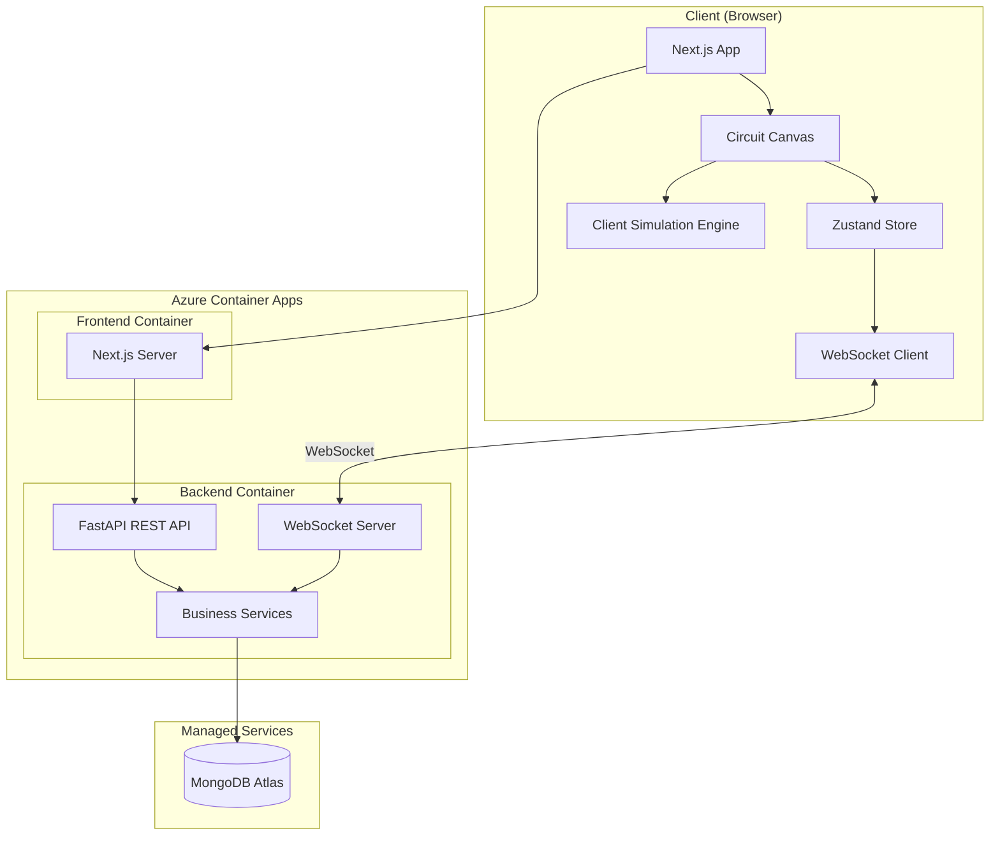
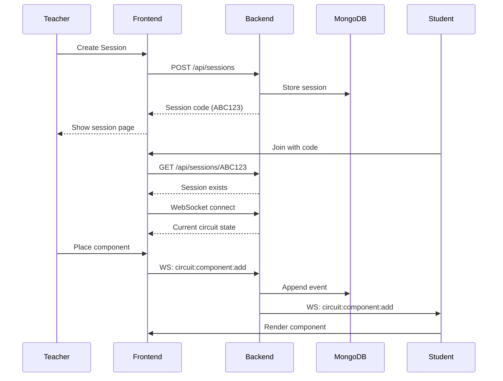

# Design Document: CircuitForge

## Overview

This document describes the technical design for **CircuitForge** - a real-time collaborative circuit design and robotics education platform. The system enables teachers and students to collaboratively build, simulate, and learn about electronic circuits using pre-built components and guided templates.

**Key Features:**
- Session-based collaboration with shareable codes (no accounts required)
- Teacher/Student role model with permission controls
- 60+ electronic components across 11 categories
- 30+ educational templates with Learning and Implementation modes
- Real-time circuit simulation with signal visualization
- Freehand annotations for teaching

**Tech Stack:**
- Frontend: Next.js 14, TypeScript, Zustand, Tailwind CSS
- Backend: FastAPI, Python 3.11+, Pydantic v2
- Database: MongoDB Atlas (free tier)
- Deployment: Azure Container Apps
- Real-time: WebSockets (native FastAPI)

## Architecture



### System Flow



## Components and Interfaces

### Frontend Architecture

```
src/
├── app/                      # Next.js App Router
│   ├── page.tsx              # Home (create/join session)
│   ├── session/[code]/       # Session page
│   ├── templates/            # Template gallery
│   └── dev/preview/          # Component preview (dev only)
├── components/
│   ├── ui/                   # Reusable UI components
│   │   ├── Button/
│   │   ├── Input/
│   │   ├── Modal/
│   │   ├── Toast/
│   │   ├── Tooltip/
│   │   ├── ColorPicker/
│   │   ├── Slider/
│   │   └── index.ts
│   ├── circuit/              # Circuit-specific components
│   │   ├── Canvas/
│   │   ├── ComponentPalette/
│   │   ├── Wire/
│   │   ├── ComponentRenderer/
│   │   └── SimulationOverlay/
│   └── layout/
│       ├── Header/
│       ├── Toolbar/
│       └── ParticipantPanel/
├── hooks/
│   ├── useWebSocket.ts
│   ├── useCircuit.ts
│   └── useSimulation.ts
├── services/
│   ├── api.ts                # REST API client
│   ├── websocket.ts          # WebSocket client
│   └── simulation.ts         # Circuit simulation
├── stores/
│   ├── circuitStore.ts       # Circuit state
│   ├── sessionStore.ts       # Session/participants
│   └── uiStore.ts            # UI state (tool, color)
├── types/
│   └── index.ts              # Shared types (generated)
└── constants/
    ├── components.ts         # Component definitions
    └── templates.ts          # Template definitions
```

### Backend Architecture

```
app/
├── api/
│   ├── sessions.py           # Session CRUD endpoints
│   ├── circuits.py           # Circuit state endpoints
│   └── health.py             # Health check
├── websocket/
│   ├── handler.py            # WebSocket connection handler
│   ├── messages.py           # Message type definitions
│   └── broadcaster.py        # Room broadcasting
├── services/
│   ├── session_service.py
│   ├── circuit_service.py
│   ├── event_store.py
│   └── permission_service.py
├── repositories/
│   ├── session_repository.py
│   ├── event_repository.py
│   └── base.py
├── models/
│   ├── session.py
│   ├── circuit.py
│   ├── events.py
│   └── participant.py
├── exceptions/
│   ├── base.py
│   └── handlers.py
└── core/
    ├── config.py
    ├── database.py
    └── logging.py
```

### Core Interfaces

#### Circuit State


```typescript
// Shared type definitions (source of truth)

interface CircuitState {
  sessionId: string;
  version: number;
  schemaVersion: string;
  components: CircuitComponent[];
  wires: Wire[];
  annotations: Annotation[];
  updatedAt: string;
}

interface CircuitComponent {
  id: string;
  type: ComponentType;
  position: Position;
  rotation: 0 | 90 | 180 | 270;
  properties: Record<string, unknown>;
  pins: Pin[];
}

type ComponentType = 
  | 'AND_2' | 'AND_3' | 'AND_4' | 'OR_2' | 'OR_3' | 'OR_4'
  | 'NOT' | 'NAND_2' | 'NAND_3' | 'NOR_2' | 'NOR_3' | 'XOR_2' | 'XNOR_2' | 'BUFFER'
  | 'SR_LATCH' | 'D_FLIPFLOP' | 'JK_FLIPFLOP' | 'T_FLIPFLOP'
  | 'MUX_2TO1' | 'MUX_4TO1' | 'DEMUX_1TO2' | 'DECODER_2TO4' | 'ADDER_4BIT' | 'COMPARATOR_4BIT'
  | 'COUNTER_4BIT' | 'SHIFT_REGISTER_8BIT'
  | 'SWITCH_TOGGLE' | 'SWITCH_PUSH' | 'DIP_SWITCH_4' | 'CLOCK' | 'CONST_HIGH' | 'CONST_LOW' | 'NUMERIC_INPUT'
  | 'LED_RED' | 'LED_GREEN' | 'LED_YELLOW' | 'LED_BLUE' | 'LED_RGB' | 'DISPLAY_7SEG' | 'DISPLAY_LCD' | 'BUZZER'
  | 'MOTOR_DC' | 'MOTOR_SERVO' | 'MOTOR_STEPPER'
  | 'RESISTOR' | 'CAPACITOR' | 'INDUCTOR' | 'DIODE' | 'ZENER' | 'TRANSISTOR_NPN' | 'TRANSISTOR_PNP'
  | 'SENSOR_LIGHT' | 'SENSOR_TEMP' | 'SENSOR_PROXIMITY' | 'SENSOR_ULTRASONIC' | 'POTENTIOMETER'
  | 'VCC_5V' | 'VCC_3V3' | 'GROUND' | 'BATTERY'
  | 'JUNCTION' | 'BUS_4BIT' | 'BUS_8BIT' | 'PIN_INPUT' | 'PIN_OUTPUT' | 'PROBE';

interface Pin {
  id: string;
  name: string;
  type: 'input' | 'output';
  position: Position; // Relative to component
}

interface Wire {
  id: string;
  fromComponentId: string;
  fromPinId: string;
  toComponentId: string;
  toPinId: string;
  waypoints: Position[]; // For routing
}

interface Annotation {
  id: string;
  type: 'stroke' | 'text';
  userId: string;
  data: StrokeData | TextData;
}

interface StrokeData {
  points: Position[];
  color: string;
  width: 2 | 4 | 8;
}

interface TextData {
  content: string;
  position: Position;
  fontSize: number;
}

interface Position {
  x: number;
  y: number;
}
```

#### Session and Participants

```typescript
interface Session {
  code: string;           // 6-char uppercase alphanumeric
  createdAt: string;
  lastActivityAt: string;
  creatorParticipantId: string;
}

interface Participant {
  id: string;             // UUID stored in localStorage
  sessionCode: string;
  displayName: string;
  role: 'teacher' | 'student';
  canEdit: boolean;
  color: string;          // Assigned cursor color
  isActive: boolean;
  lastSeenAt: string;
}

interface EditRequest {
  participantId: string;
  displayName: string;
  requestedAt: string;
  status: 'pending' | 'approved' | 'denied';
}
```

#### WebSocket Messages

```typescript
// Client -> Server
type ClientMessage =
  | { type: 'circuit:component:add'; payload: { component: CircuitComponent } }
  | { type: 'circuit:component:move'; payload: { componentId: string; position: Position } }
  | { type: 'circuit:component:delete'; payload: { componentId: string } }
  | { type: 'circuit:wire:add'; payload: { wire: Wire } }
  | { type: 'circuit:wire:delete'; payload: { wireId: string } }
  | { type: 'circuit:annotation:add'; payload: { annotation: Annotation } }
  | { type: 'circuit:annotation:delete'; payload: { annotationId: string } }
  | { type: 'circuit:undo'; payload: {} }
  | { type: 'circuit:redo'; payload: {} }
  | { type: 'presence:cursor:move'; payload: { position: Position } }
  | { type: 'presence:selection:change'; payload: { componentIds: string[] } }
  | { type: 'permission:request:edit'; payload: {} }
  | { type: 'permission:approve'; payload: { participantId: string } }
  | { type: 'permission:deny'; payload: { participantId: string } }
  | { type: 'permission:revoke'; payload: { participantId: string } };

// Server -> Client
type ServerMessage =
  | { type: 'sync:state'; payload: { circuit: CircuitState; participants: Participant[] } }
  | { type: 'circuit:component:added'; payload: { component: CircuitComponent; userId: string } }
  | { type: 'circuit:component:moved'; payload: { componentId: string; position: Position; userId: string } }
  | { type: 'circuit:component:deleted'; payload: { componentId: string; userId: string } }
  | { type: 'circuit:wire:added'; payload: { wire: Wire; userId: string } }
  | { type: 'circuit:wire:deleted'; payload: { wireId: string; userId: string } }
  | { type: 'circuit:annotation:added'; payload: { annotation: Annotation; userId: string } }
  | { type: 'circuit:annotation:deleted'; payload: { annotationId: string; userId: string } }
  | { type: 'circuit:state:updated'; payload: { version: number } }
  | { type: 'presence:cursor:moved'; payload: { participantId: string; position: Position } }
  | { type: 'presence:selection:changed'; payload: { participantId: string; componentIds: string[] } }
  | { type: 'presence:participant:joined'; payload: { participant: Participant } }
  | { type: 'presence:participant:left'; payload: { participantId: string } }
  | { type: 'permission:request:received'; payload: { participantId: string; displayName: string } }
  | { type: 'permission:granted'; payload: { participantId: string } }
  | { type: 'permission:denied'; payload: { participantId: string } }
  | { type: 'permission:revoked'; payload: { participantId: string } }
  | { type: 'error'; payload: { code: string; message: string } };
```

#### REST API Endpoints

| Method | Endpoint | Description | Request | Response |
|--------|----------|-------------|---------|----------|
| POST | `/api/sessions` | Create session | `{}` | `{ code: string }` |
| GET | `/api/sessions/{code}` | Get session info | - | `Session` |
| POST | `/api/sessions/{code}/join` | Join session | `{ displayName: string, participantId?: string }` | `{ participant: Participant }` |
| GET | `/api/sessions/{code}/circuit` | Get circuit state | - | `CircuitState` |
| POST | `/api/sessions/{code}/export/png` | Export as PNG | - | `image/png` |
| POST | `/api/sessions/{code}/export/json` | Export as JSON | - | `CircuitState` |
| POST | `/api/sessions/{code}/import` | Import circuit | `CircuitState` | `{ success: boolean }` |

## Data Models

### MongoDB Collections

```javascript
// sessions collection
{
  _id: ObjectId,
  code: "ABC123",
  creatorParticipantId: "uuid",
  createdAt: ISODate,
  lastActivityAt: ISODate
}

// participants collection
{
  _id: ObjectId,
  id: "uuid",
  sessionCode: "ABC123",
  displayName: "John",
  role: "teacher" | "student",
  canEdit: true,
  color: "#FF5733",
  isActive: true,
  lastSeenAt: ISODate
}

// events collection (event sourcing)
{
  _id: ObjectId,
  sessionCode: "ABC123",
  version: 1,
  type: "COMPONENT_ADDED",
  payload: { component: {...} },
  userId: "uuid",
  timestamp: ISODate
}

// snapshots collection
{
  _id: ObjectId,
  sessionCode: "ABC123",
  version: 100,
  state: { components: [...], wires: [...], annotations: [...] },
  createdAt: ISODate
}
```

### Event Types for Event Sourcing

```typescript
type CircuitEvent =
  | { type: 'COMPONENT_ADDED'; payload: { component: CircuitComponent } }
  | { type: 'COMPONENT_MOVED'; payload: { componentId: string; position: Position } }
  | { type: 'COMPONENT_DELETED'; payload: { componentId: string } }
  | { type: 'WIRE_ADDED'; payload: { wire: Wire } }
  | { type: 'WIRE_DELETED'; payload: { wireId: string } }
  | { type: 'ANNOTATION_ADDED'; payload: { annotation: Annotation } }
  | { type: 'ANNOTATION_DELETED'; payload: { annotationId: string } };
```


## Correctness Properties

*A property is a characteristic or behavior that should hold true across all valid executions of a system-essentially, a formal statement about what the system should do. Properties serve as the bridge between human-readable specifications and machine-verifiable correctness guarantees.*

### Property 1: Session Code Uniqueness and Format
*For any* number of session creation requests, all generated session codes SHALL be unique, exactly 6 characters long, and contain only uppercase letters (A-Z) and digits (0-9).
**Validates: Requirements 1.1**

### Property 2: Role-Based Edit Permission
*For any* participant with role "student" and canEdit=false, attempting to perform an edit action (add/move/delete component, add/delete wire, add annotation) SHALL be rejected by the system.
**Validates: Requirements 3.2, 3.6**

### Property 3: Component Deletion Cascades to Wires
*For any* circuit state with components and wires, when a component is deleted, all wires connected to that component (either fromComponentId or toComponentId matches) SHALL also be removed from the circuit state.
**Validates: Requirements 4.4**

### Property 4: Wire Connection Validation
*For any* wire creation attempt, the system SHALL accept the wire only if it connects an output pin to an input pin. Connections from output-to-output, input-to-input, or input-to-output SHALL be rejected.
**Validates: Requirements 5.2**

### Property 5: Concurrent Edit Preservation
*For any* set of valid edit operations applied concurrently by multiple users, all operations SHALL be reflected in the final circuit state with no data loss.
**Validates: Requirements 6.4**

### Property 6: Eraser Intersection Removal
*For any* annotation stroke and eraser path that geometrically intersect, the stroke SHALL be removed from the circuit state after the erase operation.
**Validates: Requirements 8.3**

### Property 7: Logic Gate Truth Tables
*For any* logic gate component with valid input signals, the output signal SHALL match the expected truth table:
- AND: Output HIGH only when all inputs are HIGH
- OR: Output HIGH when any input is HIGH
- NOT: Output is inverse of input
- NAND: Output LOW only when all inputs are HIGH
- NOR: Output LOW when any input is HIGH
- XOR: Output HIGH when exactly one input is HIGH (for 2-input)
**Validates: Requirements 9.3**

### Property 8: Undo/Redo Round-Trip
*For any* circuit state and valid edit action, performing the action followed by undo SHALL restore the circuit to its previous state, and performing redo SHALL restore the action's effect.
**Validates: Requirements 12.1, 12.2**

### Property 9: Circuit State Serialization Round-Trip
*For any* valid circuit state, serializing to JSON and then deserializing SHALL produce a circuit state that is equivalent to the original (same components, wires, annotations with identical properties).
**Validates: Requirements 14.1, 14.2, 14.3**

### Property 10: Schema Version Inclusion
*For any* serialized circuit state JSON, the output SHALL contain a schemaVersion field with a valid semantic version string.
**Validates: Requirements 14.4**

## Error Handling

### Custom Exception Hierarchy

```python
class AppException(Exception):
    """Base exception for all application errors"""
    code: str
    message: str
    status_code: int = 500

class ValidationException(AppException):
    """Invalid input data"""
    status_code = 400

class NotFoundException(AppException):
    """Resource not found"""
    status_code = 404
    
    def __init__(self, resource: str, identifier: str):
        self.code = "NOT_FOUND"
        self.message = f"{resource} '{identifier}' not found"

class AuthorizationException(AppException):
    """Permission denied"""
    status_code = 403
    
    def __init__(self, action: str, reason: str):
        self.code = "FORBIDDEN"
        self.message = f"Cannot {action}: {reason}"

class ConflictException(AppException):
    """Concurrent modification conflict"""
    status_code = 409

class ConnectionException(AppException):
    """WebSocket/database connection issues"""
    status_code = 503

class SimulationException(AppException):
    """Circuit simulation errors"""
    status_code = 422
    
    def __init__(self, error_type: str, details: dict):
        self.code = f"SIMULATION_{error_type}"
        self.message = self._format_message(error_type, details)
```

### Error Response Format

```json
{
  "error": {
    "code": "NOT_FOUND",
    "message": "Session 'ABC123' not found",
    "requestId": "req_abc123xyz"
  }
}
```

### WebSocket Error Codes

| Code | Name | Description |
|------|------|-------------|
| `AUTH_FAILED` | Authentication Failed | Invalid or expired participant ID |
| `SESSION_NOT_FOUND` | Session Not Found | Session code doesn't exist |
| `PERMISSION_DENIED` | Permission Denied | User lacks edit permission |
| `INVALID_MESSAGE` | Invalid Message | Message format validation failed |
| `RATE_LIMITED` | Rate Limited | Too many actions per minute |
| `SIMULATION_ERROR` | Simulation Error | Circuit has errors preventing simulation |

## Testing Strategy

### Testing Framework

- **Frontend**: Vitest + React Testing Library
- **Backend**: pytest + pytest-asyncio
- **E2E**: Playwright

Note: Property-based testing will use Hypothesis (Python) and fast-check (TypeScript) as extensions to the primary testing frameworks.

### Property-Based Testing

Each correctness property will be implemented as a property-based test:

```python
# Example: Property 7 - Logic Gate Truth Tables (Hypothesis)
from hypothesis import given, strategies as st

@given(input_a=st.booleans(), input_b=st.booleans())
def test_and_gate_truth_table(input_a: bool, input_b: bool):
    """
    **Feature: circuit-forge, Property 7: Logic Gate Truth Tables**
    """
    gate = AndGate()
    result = gate.evaluate([input_a, input_b])
    assert result == (input_a and input_b)
```

```typescript
// Example: Property 9 - Serialization Round-Trip (fast-check)
import fc from 'fast-check';

test('circuit state serialization round-trip', () => {
  /**
   * **Feature: circuit-forge, Property 9: Circuit State Serialization Round-Trip**
   */
  fc.assert(
    fc.property(circuitStateArbitrary, (state) => {
      const serialized = serializeCircuit(state);
      const deserialized = deserializeCircuit(serialized);
      expect(deserialized).toEqual(state);
    }),
    { numRuns: 100 }
  );
});
```

### Test Coverage Requirements

| Layer | Coverage Target | Test Type |
|-------|-----------------|-----------|
| Domain Logic | 90% | Unit + Property |
| Services | 80% | Unit + Integration |
| API Handlers | 70% | Integration |
| UI Components | 60% | Unit + Snapshot |
| E2E Flows | Critical paths | E2E |

### Key Test Scenarios

1. **Session Management**: Create, join, rejoin, expiry
2. **Permission Flow**: Request, approve, deny, revoke
3. **Circuit Operations**: Add/move/delete components and wires
4. **Real-time Sync**: Multi-user concurrent edits
5. **Simulation**: All gate types, error detection
6. **Undo/Redo**: Single user, multi-user scenarios
7. **Export/Import**: Valid and invalid files

## Component Library

### UI Components (Preview Page)

All components available at `/dev/preview` in development:

| Category | Components |
|----------|------------|
| Actions | Button, IconButton |
| Inputs | Input, Select, Checkbox, Slider, ColorPicker |
| Feedback | Toast, Spinner, ProgressBar, Badge, Tooltip |
| Layout | Card, Panel, Modal, Drawer, Tabs, Accordion |
| Data Display | Avatar, List, EmptyState |

### Component Interface Standard

```typescript
interface BaseComponentProps {
  variant?: 'primary' | 'secondary' | 'ghost' | 'danger';
  size?: 'sm' | 'md' | 'lg';
  disabled?: boolean;
  className?: string;
}
```

## Deployment Architecture

### Azure Container Apps Configuration

```yaml
# Frontend Container
name: circuit-frontend
image: circuit-frontend:latest
resources:
  cpu: 0.5
  memory: 1Gi
scale:
  minReplicas: 0
  maxReplicas: 2
  rules:
    - name: http-scaling
      http:
        metadata:
          concurrentRequests: 50

# Backend Container
name: circuit-backend
image: circuit-backend:latest
resources:
  cpu: 0.5
  memory: 1Gi
scale:
  minReplicas: 0
  maxReplicas: 2
  rules:
    - name: http-scaling
      http:
        metadata:
          concurrentRequests: 30
ingress:
  transport: http
  allowInsecure: false
```

### Environment Variables

```
# Backend
MONGODB_URI=mongodb+srv://...
CORS_ORIGINS=https://circuit.example.com
LOG_LEVEL=INFO

# Frontend
NEXT_PUBLIC_API_URL=https://api.circuit.example.com
NEXT_PUBLIC_WS_URL=wss://api.circuit.example.com/ws
```
