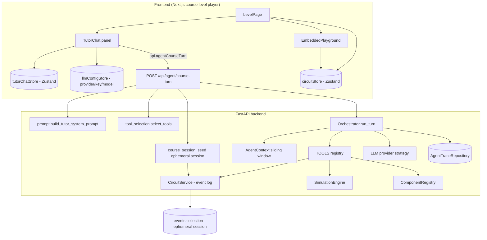
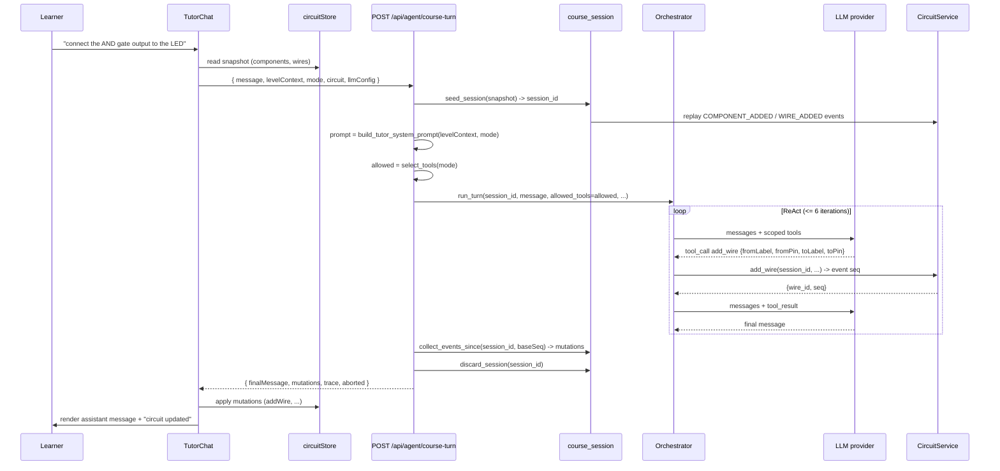
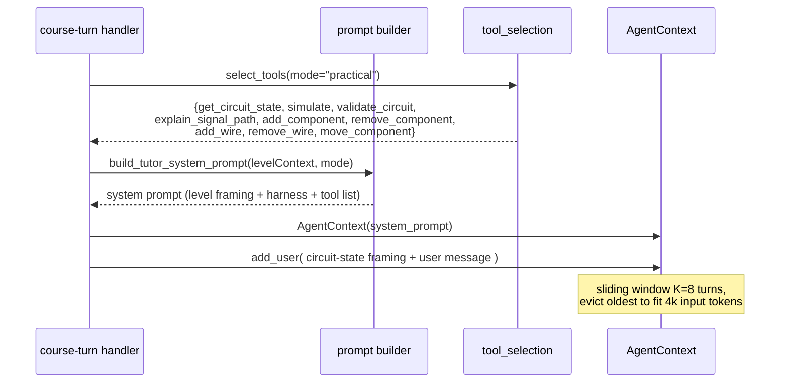

# Design Document: In-Course AI Tutor

## Overview

The In-Course AI Tutor adds a per-step chatbot to the course level player so a learner can ask the LLM for help ("I can't connect two items", "the circuit isn't working") while building a circuit. The tutor can **see** the learner's current playground state, **answer** questions about the circuit and the lesson, and **make changes** to the board through tool calls.

This feature **extends the agent harness that already exists** under `backend/app/services/agent/` (ReAct orchestrator, sliding-window `AgentContext`, strict Pydantic `TOOL_SCHEMAS`, six tools routed through `CircuitService`). It does **not** rebuild it. The work is concentrated in five gaps the existing harness does not cover:

1. **Connection/move tools.** Only `add_component`/`remove_component` exist. We add `add_wire`, `remove_wire`, and `move_component` tools (CircuitService already exposes the underlying methods) plus registry-aware pin validation.
2. **State bridging.** The harness reads/writes via DB-backed `CircuitService` (session + event log), but the course player holds state in a browser-local Zustand `circuitStore`. We back the course tutor with an **ephemeral server session** seeded from the client snapshot each turn, then apply the resulting events back into the local store.
3. **Frontend chat UI + API client.** No chat panel and no `api.agentTurn(...)` exist. We add a per-step-aware `TutorChat` panel embedded in the level player and one client method, reusing the existing `llmConfigStore` / `APIKeyModal` provider config.
4. **Course-aware system prompt.** The hardcoded generic `SYSTEM_PROMPT` becomes a builder that injects level context (objectives, build steps, components needed, expected behavior, common mistakes) plus a harness/tool description.
5. **Context-window & tool-selection management.** The sliding window is extended with course/level + circuit-state framing, and the tool set exposed to the LLM is scoped by lesson step (read-only on theory, full mutation set on practical).

This document covers both **High-Level Design** (architecture, sequence, components, data models) and **Low-Level Design** (tool schemas with signatures, the prompt builder, context/tool-selection algorithms with pre/post-conditions, frontend signatures) and the testing strategy.

### What is extended vs newly added

| Area | Module | Extended / New | Notes |
|---|---|---|---|
| Tool schemas | `backend/app/services/agent/schemas.py` | **Extended** | Add `AddWireArgs/Result`, `RemoveWireArgs/Result`, `MoveComponentArgs/Result`; register in `TOOL_SCHEMAS`. |
| Tools | `backend/app/services/agent/tools/` | **New files** | `add_wire.py`, `remove_wire.py`, `move_component.py`; register in `TOOLS`. |
| Pin validation | `backend/app/services/agent/tools/_helpers.py` | **Extended** | Add `_resolve_pin` (label/pin-name → pin id, registry-aware). |
| System prompt | `backend/app/api/agent.py` → `backend/app/services/agent/prompt.py` | **New file** | `build_tutor_system_prompt(level_context, mode)`. Generic `SYSTEM_PROMPT` stays as fallback for the non-course `/agent/turn`. |
| Tool selection | `backend/app/services/agent/tool_selection.py` | **New file** | `select_tools(mode) -> set[str]`. |
| Orchestrator | `backend/app/services/agent/orchestrator/loop.py` | **Extended** | `run_turn` accepts an optional `allowed_tools: set[str]` to scope `_tools_for_llm`. |
| Ephemeral session | `backend/app/services/agent/course_session.py` | **New file** | Seed a throwaway session from a client snapshot; collect emitted events. |
| API | `backend/app/api/agent.py` | **Extended** | Add `POST /api/agent/course-turn`. Existing `POST /api/agent/turn` unchanged. |
| Frontend client | `frontend/src/services/api.ts` | **Extended** | Add `api.agentCourseTurn(...)`. |
| Chat UI | `frontend/src/components/circuit/TutorChat.tsx` | **New file** | Embedded panel in the level player. |
| Chat state | `frontend/src/stores/tutorChatStore.ts` | **New file** | Per-step message history + pending state. |
| Level player | `frontend/src/app/courses/[courseId]/level/[levelNum]/page.tsx` | **Extended** | Mount `TutorChat`, pass level + step context, apply returned mutations to `circuitStore`. |

### Design assumptions (stated explicitly, per AGENTS.md)

- The course player is **single-user and browser-local**; it is not the collaborative websocket session. So the tutor does not need realtime fan-out — a request/response turn that seeds an ephemeral server session is sufficient and simplest.
- Responses are **non-streaming**. The existing `/agent/turn` is request/response and the ReAct loop completes server-side before returning; streaming is not added (KISS — not requested as a hard requirement, and the loop is multi-step not token-stream-shaped).
- LLM provider/key/model is **per-request, never stored server-side**, matching every existing course endpoint.
- The ephemeral session is **discarded after the turn**; we do not persist tutor edits to the event store. The client store remains the source of truth for the course playground.

---

## Architecture



The new path (`/api/agent/course-turn`) reuses the existing `Orchestrator`, `AgentContext`, `dispatch`, `TOOLS`, `CircuitService`, `SimulationEngine`, and `ComponentRegistry` unchanged in spirit. The only orchestrator change is an optional `allowed_tools` filter. Everything else around it (prompt builder, tool selector, ephemeral-session seeding, event collection) is new and sits *beside* the harness, not inside it.

### State-bridging approach (the core architectural decision)

**Problem.** The agent harness mutates circuit state through `CircuitService`, which is keyed by `session_id` and backed by an append-only event log in Mongo. The course playground keeps its circuit in a browser-local Zustand store with **no** server session and **no** event log. The LLM must both *see* that local state and *change* it.

**Options considered:**

- **(A) Snapshot-in / events-out via an ephemeral server session.** Each turn, the client sends its current circuit snapshot. The backend seeds a short-lived `CircuitService` session from that snapshot, runs the ReAct loop (tools mutate that session), collects the events the tools emitted, returns a list of structural mutations, and the client replays them into `circuitStore`. The ephemeral session is then discarded.
- **(B) Make the course playground a first-class server session.** Back the `EmbeddedPlayground` with a real session + websocket, like the collaborative editor. The agent then operates on the live session directly.

**Recommendation: Option (A).**

Rationale against the existing architecture and the AGENTS.md "keep it simple" principle:

- Option (B) is a large change: it forces every course level into the websocket/session lifecycle, presence handling, reconnect protocol, and DB persistence — none of which the course player needs today (it is single-user and local). That is exactly the "build what might be needed" over-engineering AGENTS.md forbids.
- Option (A) reuses the harness **as-is**. Tools keep routing through `CircuitService`; we only add a thin seed step (replay the snapshot into a fresh session's event log) and an event-collection step (read back the events emitted during the turn). The client already knows how to apply circuit mutations (the `circuitStore` has `addComponent`/`moveComponent`/`addWire`/`deleteWire`/`deleteComponent`).
- Snapshots are small (a course circuit is a handful of components) so sending one per turn is cheap and well within the 4k input-token budget after framing.

The trade-off we accept: the LLM sees a *point-in-time* snapshot, not a live stream. For a single-user tutor that is correct — the snapshot is exactly what the learner currently has on screen.

---

## Sequence Diagrams

### Main flow: a course-turn that adds a wire



### Tool-selection / context-framing per turn



---

## Tool Inventory: what exists, what is missing, what we add

The user's first ask is to verify the LLM has the tools it needs to build/help with circuits and add what is missing. Audit of the current agent `TOOLS` registry:

| Tool | Status | Capability |
|---|---|---|
| `get_circuit_state` | exists | Read components + wires (the LLM's "eyes"). |
| `simulate` | exists | Evaluate circuit / advance clocks; returns pin + wire signals. |
| `add_component` | exists | Place a component from the registry. |
| `remove_component` | exists | Delete a component (cascades its wires). |
| `validate_circuit` | exists | Floating inputs, output conflicts, combinational cycles. |
| `explain_signal_path` | exists | Trace a signal between two components. |
| **`add_wire`** | **MISSING → add** | Connect an output pin to an input pin. Directly addresses "I can't connect two items". |
| **`remove_wire`** | **MISSING → add** | Remove a wrong connection. Needed to fix mis-wiring. |
| **`move_component`** | **MISSING → add** | Reposition a component so it can be wired/read clearly. |

`CircuitService` **already implements** `add_wire`, `delete_wire`, and `move_component`, and `validate_wire_connection` already enforces output→input direction and single-driver inputs. So the gap is purely the **agent-tool wrappers + Pydantic schemas + registry-aware pin resolution** — no service work.

### Pin-addressing decision

The LLM reasons in terms of **labels and pin names** ("AND1", pin "Y"), not internal UUID pin ids. The persisted `Wire` model needs `fromComponentId/fromPinId/toComponentId/toPinId` (UUIDs). Internal pin ids are generated per-instance (`{componentId}-pin-{index}` on the client, `pin.name` on the backend `_registry_pins`). To keep the LLM contract stable and avoid leaking UUIDs into the prompt, the wire tool accepts **component label + registry pin name** and resolves them to ids server-side via a new `_resolve_pin` helper. This mirrors the existing `BlueprintWire` "LABEL:PIN" convention already used by `blueprintLoader.ts` and the course-generation tools.

Because the backend `add_component` builds pins with `id == pin.name` (see `_registry_pins`), pin-name resolution on the backend is exact; the helper validates the name against the registry and raises a structured `ToolError("INVALID_PIN", ...)` on mismatch — feeding the LLM a correctable error rather than a 5xx.

---

## Data Models

### New tool schemas (extend `backend/app/services/agent/schemas.py`)

```python
# --- add_wire -------------------------------------------------------------

class AddWireArgs(BaseModel):
    """Connect an output pin to an input pin, addressed by label + pin name."""
    session_id: str
    actor_id: str
    from_label: str          # component label, e.g. "AND1"
    from_pin: str            # registry pin name on the source, e.g. "Y"
    to_label: str            # component label, e.g. "LED1"
    to_pin: str              # registry pin name on the target, e.g. "A"


class AddWireResult(BaseModel):
    wire_id: str
    seq: int = Field(ge=1)


# --- remove_wire ----------------------------------------------------------

class RemoveWireArgs(BaseModel):
    session_id: str
    actor_id: str
    wire_id: str


class RemoveWireResult(BaseModel):
    seq: int = Field(ge=1)


# --- move_component -------------------------------------------------------

class MoveComponentArgs(BaseModel):
    session_id: str
    actor_id: str
    component_id: str
    position: Position       # reuse app.models.circuit.Position


class MoveComponentResult(BaseModel):
    seq: int = Field(ge=1)
```

Registry additions (strict, no `Optional`, matching the existing six-tool style):

```python
TOOL_SCHEMAS.update({
    "add_wire": (AddWireArgs, AddWireResult),
    "remove_wire": (RemoveWireArgs, RemoveWireResult),
    "move_component": (MoveComponentArgs, MoveComponentResult),
})
```

### Course-turn request/response (camelCase aliases, matching `agent.py` convention)

```python
class CourseTurnRequest(BaseModel):
    actor_id: str = Field(alias="actorId")          # participant id
    message: str
    course_id: str = Field(alias="courseId")
    level_number: int = Field(alias="levelNumber")
    mode: Literal["theory", "practical"]            # which lesson step
    circuit: CircuitState                           # client snapshot ("the eyes")
    provider_id: str = Field(alias="providerId")
    api_key: str = Field(alias="apiKey")
    model: str
    model_config = {"populate_by_name": True}


class CircuitMutation(BaseModel):
    """A structural change the client applies to its local circuitStore."""
    type: CircuitEventType            # COMPONENT_ADDED | WIRE_ADDED | ...
    payload: dict[str, Any]           # the event payload, already camelCased


class CourseTurnResponse(BaseModel):
    final_message: str = Field(alias="finalMessage")
    mutations: list[CircuitMutation]
    trace: list[dict]
    tokens_in: int = Field(alias="tokensIn")
    tokens_out: int = Field(alias="tokensOut")
    iterations: int
    aborted: bool
    abort_reason: str | None = Field(alias="abortReason")
    model_config = {"populate_by_name": True}
```

The `mutations` list is built from the events the seeded session emitted during the turn (`get_events_since_seq(session_id, base_seq)`), filtered to the structural event types the client store knows how to apply. This is the "events-out" half of the state bridge.

### LevelContext (the prompt's source material)

The handler loads `LevelContent` (Beanie) for `(course_id, level_number)` and projects only the fields the prompt needs into a small dataclass — keeping the system prompt bounded:

```python
@dataclass
class LevelContext:
    title: str
    objectives: list[str]              # theory.objectives
    expected_behavior: str             # practical.expected_behavior
    components_needed: list[str]       # ["AND_2 x1", "LED_RED x1", ...]
    build_steps: list[str]             # practical.steps[].instruction
    common_mistakes: list[str]         # practical.common_mistakes
```

---

## Key Functions with Formal Specifications

### `add_wire` tool

```python
async def add_wire(args: AddWireArgs, *, deps: ToolDeps) -> AddWireResult: ...
```

**Preconditions:**
- `args.session_id` refers to an existing (ephemeral) session.
- `args.from_label` / `args.to_label` match component labels present in that session's state.
- `args.from_pin` is an OUTPUT pin name and `args.to_pin` is an INPUT pin name per the registry.

**Postconditions:**
- On success: a `WIRE_ADDED` event is appended; returns `{wire_id, seq}` with `seq` == the new event's seq.
- The target input pin had no prior connection (single-driver rule).
- No mutation occurs on any failure path; instead a `ToolError` is raised with a stable code.

**Failure modes (structured `ToolError`, fed back to the LLM):**
- `COMPONENT_NOT_FOUND` — a label does not resolve to a component.
- `INVALID_PIN` — pin name is not on the component per the registry.
- `INVALID_WIRE_DIRECTION` — source not OUTPUT or target not INPUT.
- `INPUT_ALREADY_CONNECTED` / `DUPLICATE_WIRE` — surfaced from `validate_wire_connection`.

**Loop invariants:** N/A (no loops; label→pin resolution is two linear lookups over the snapshot's components).

### `move_component` tool

```python
async def move_component(args: MoveComponentArgs, *, deps: ToolDeps) -> MoveComponentResult: ...
```

**Preconditions:** `args.component_id` exists in the session state.
**Postconditions:** a `COMPONENT_MOVED` event is appended; returns its `seq`. Topology (wires) unchanged.
**Failure modes:** `COMPONENT_NOT_FOUND` (mapped from `NotFoundException`).
**Loop invariants:** N/A.

### `remove_wire` tool

```python
async def remove_wire(args: RemoveWireArgs, *, deps: ToolDeps) -> RemoveWireResult: ...
```

**Preconditions:** `args.wire_id` exists in the session state.
**Postconditions:** a `WIRE_DELETED` event is appended; returns its `seq`.
**Failure modes:** `WIRE_NOT_FOUND` (mapped from `NotFoundException`).
**Loop invariants:** N/A.

### `_resolve_pin` helper (extend `_helpers.py`)

```python
def _resolve_pin(
    registry: ComponentRegistry,
    components: list[CircuitComponent],
    label: str,
    pin_name: str,
    expected: PinType,
) -> tuple[str, str]: ...   # -> (component_id, pin_id)
```

**Preconditions:** `components` is the current session snapshot.
**Postconditions:** returns `(component_id, pin_id)` for the component whose label matches `label` and whose registry pin matches `pin_name` with `pin.type == expected`.
**Failure modes:** raises `ToolError("COMPONENT_NOT_FOUND" | "INVALID_PIN", ...)`.

> Note: `CircuitComponent` (backend `app.models.circuit`) has no `label` field today; labels live on the frontend type and on `BlueprintComponent`. The seeding step (below) stores the client label in `component.properties["label"]` when replaying the snapshot, and `_resolve_pin` reads it from there. This keeps the backend model untouched (surgical change) while giving the LLM stable label addressing.

### `build_tutor_system_prompt` (new `prompt.py`)

```python
def build_tutor_system_prompt(level: LevelContext, mode: Literal["theory", "practical"]) -> str: ...
```

**Preconditions:** `level` is populated from `LevelContent`; `mode` is the current lesson tab.
**Postconditions:** returns a deterministic prompt string containing, in order: (1) tutor role + the harness description, (2) the level framing (title, objectives; on `practical` also components-needed, build steps, expected behavior, common mistakes), (3) the names + one-line purpose of the tools available **in this mode**, (4) behavioral rules (don't invent component/pin names, prefer the smallest tool sequence, explain edits in plain language).
**Loop invariants:** N/A.

### `select_tools` (new `tool_selection.py`)

```python
def select_tools(mode: Literal["theory", "practical"]) -> set[str]: ...
```

**Preconditions:** `mode` is a valid lesson step.
**Postconditions:**
- `theory` → read-only set: `{get_circuit_state, simulate, validate_circuit, explain_signal_path}`.
- `practical` → full set: read-only ∪ `{add_component, remove_component, add_wire, remove_wire, move_component}`.
- The returned set is always a subset of `TOOL_SCHEMAS.keys()`.

**Rationale:** On the theory step the learner is reading, not building, so exposing mutation tools wastes prompt tokens and invites accidental edits. Scoping the tool list both shrinks the input token footprint and sharpens tool selection.

### Orchestrator extension (`loop.py`)

`run_turn` gains one optional-but-explicit parameter and `_tools_for_llm` gains a filter. This is the only change inside the existing harness.

```python
async def run_turn(
    self, session_id, actor_id, message, *, provider_id, api_key, model,
    tools_registry, context, trace_repo,
    allowed_tools: set[str],          # NEW — explicit, always passed by callers
) -> TurnResult: ...

@staticmethod
def _tools_for_llm(allowed_tools: set[str]) -> list[dict[str, Any]]:
    # same as today, but iterate only names in `allowed_tools`
```

To honor AGENTS.md ("don't mark arguments optional unless the flow truly allows omission"), `allowed_tools` is **required**. The existing `/agent/turn` caller passes `set(TOOL_SCHEMAS)` (all tools) to preserve current behavior; the course caller passes `select_tools(mode)`.

---

## Algorithmic Pseudocode

### Course-turn handler (the orchestration glue)

```pascal
ALGORITHM handleCourseTurn(req)
INPUT:  req of type CourseTurnRequest
OUTPUT: resp of type CourseTurnResponse

BEGIN
  // 1. Load lesson context (bounded projection of LevelContent)
  content   ← levelContentRepo.get(req.course_id, req.level_number)
  level     ← projectLevelContext(content)

  // 2. Build prompt + scope tools for this lesson step
  system    ← build_tutor_system_prompt(level, req.mode)
  allowed   ← select_tools(req.mode)

  // 3. Seed an ephemeral session from the client snapshot
  session_id ← seed_session(req.circuit)          // see seedSession below
  base_seq   ← event_repo.get_latest_seq(session_id)

  // 4. Frame the circuit state + user message into one user turn
  context   ← AgentContext(system)
  framing   ← renderCircuitFraming(req.circuit)   // compact text view of board
  context.add_user(framing + "\n\n" + req.message) IS DEFERRED
  // NOTE: run_turn calls context.add_user(message) internally, so we pass
  //       (framing + message) as the `message` argument instead.

  // 5. Run the existing ReAct loop, tools scoped to `allowed`
  result    ← orchestrator.run_turn(
                session_id, req.actor_id, framing + "\n\n" + req.message,
                provider_id=req.provider_id, api_key=req.api_key,
                model=req.model, tools_registry=TOOLS,
                context=context, trace_repo=trace_repo,
                allowed_tools=allowed)

  // 6. Collect events-out, map to client mutations, discard the session
  events    ← event_repo.get_events_since_seq(session_id, base_seq)
  mutations ← [ toClientMutation(e) FOR e IN events
                IF e.type IN CLIENT_APPLICABLE_TYPES ]
  discard_session(session_id)

  RETURN CourseTurnResponse(
    finalMessage = result.final_message,
    mutations    = mutations,
    trace        = result.trace,
    tokensIn     = result.tokens_in, tokensOut = result.tokens_out,
    iterations   = result.iterations, aborted = result.aborted,
    abortReason  = result.abort_reason)
END
```

**Preconditions:** `req.circuit` is the learner's current board; `LevelContent` for the level is `generated`.
**Postconditions:** the response's `mutations` exactly equal the structural events the tools emitted this turn (no more, no less); the ephemeral session no longer exists after return.
**Loop invariants (over step 6's comprehension):** every collected event has `seq > base_seq` and a `type` the client store can apply.

### Ephemeral session seeding (`course_session.py`)

```pascal
ALGORITHM seed_session(circuit)
INPUT:  circuit of type CircuitState (client snapshot)
OUTPUT: session_id of type String

BEGIN
  session_id ← "tutor-" + uuid4()        // namespaced so it never collides
                                          // with 6-char collaborative codes
  actor      ← "tutor-agent"

  FOR each component IN circuit.components DO
    // preserve the client label for label-addressed tools
    backendComp ← toBackendComponent(component)         // copies pins, position
    backendComp.properties["label"] ← component.label
    circuit_service.add_component(session_id, actor, backendComp)
  END FOR

  FOR each wire IN circuit.wires DO
    circuit_service.add_wire(session_id, actor, toBackendWire(wire))
  END FOR

  RETURN session_id
END
```

**Preconditions:** `circuit` is well-formed (the client only ever sends what `circuitStore` holds).
**Postconditions:** `get_circuit_state(session_id)` reconstructs a board equal (up to ids) to `circuit`; `get_latest_seq(session_id)` returns `len(components) + len(wires)`.
**Loop invariants:** after iteration *i* of the component loop, *i* `COMPONENT_ADDED` events exist for the session, each with a strictly increasing `seq`.

```pascal
ALGORITHM discard_session(session_id)
BEGIN
  event_repo.delete_events_by_session(session_id)      // contract.md: exists
  event_repo.delete_snapshots_by_session(session_id)   // contract.md: exists
  circuit_service.cleanup_session(session_id)          // drops undo/redo stacks
END
```

> The seed/discard pair reuses `EventRepository.delete_events_by_session` / `delete_snapshots_by_session` already defined in `contracts.md` (Story A). Snapshot interval is 50, so a small course circuit never triggers a snapshot — discard is just an event delete plus in-memory stack cleanup.

### Circuit-state framing (the LLM's "eyes", token-bounded)

```pascal
ALGORITHM renderCircuitFraming(circuit)
INPUT:  circuit of type CircuitState
OUTPUT: text of type String   (compact, deterministic)

BEGIN
  IF circuit.components IS EMPTY THEN
    RETURN "Current board: empty."
  END IF

  lines ← ["Current board:"]
  FOR each c IN circuit.components DO
    lines.add("- " + c.label + " (" + c.type + ")")
  END FOR
  lines.add("Connections:")
  IF circuit.wires IS EMPTY THEN
    lines.add("- none")
  ELSE
    FOR each w IN circuit.wires DO
      src ← labelOf(circuit, w.fromComponentId) + ":" + pinNameOf(w.fromPinId)
      dst ← labelOf(circuit, w.toComponentId)   + ":" + pinNameOf(w.toPinId)
      lines.add("- " + src + " -> " + dst)
    END FOR
  END IF
  RETURN join(lines, "\n")
END
```

**Preconditions:** `circuit` is the snapshot from the request.
**Postconditions:** returns a human-and-LLM-readable summary using **labels + pin names** (never UUIDs), so the LLM's wire-tool arguments line up with what it was shown. Output is `O(components + wires)` lines.
**Loop invariants:** N/A beyond linear accumulation.

This framing is what makes "the LLM can see the playground" concrete: the board is rendered into the user turn each request, so the model always reasons about the learner's *actual* current circuit, not a stale one.

### Context-window management (extends existing `AgentContext`)

The existing `AgentContext` already does the hard part: K=8 turn cap, char/4 token estimate, evict-oldest-whole-turn until under `max_tokens`, system prompt never dropped. We do **not** rewrite it. The tutor's context budget is composed as:

```
total_input_budget = DEFAULT_MAX_INPUT_TOKENS (4000)
  ├─ system prompt   : level framing + harness + scoped tool list   (bounded by build_tutor_system_prompt)
  ├─ tool schemas    : only `allowed_tools` (theory ≈ 4 tools, practical ≈ 9)
  └─ message turns   : sliding window; each user turn = circuit framing + user text
```

```pascal
ALGORITHM messagesForTurn(context, max_input_tokens)   // existing behavior, restated
BEGIN
  turns ← copy(context.turns)
  REPEAT len(turns)+1 TIMES
    messages ← [system] + flatten(turns)
    IF estimateTokens(messages) <= max_input_tokens THEN RETURN messages
    IF turns IS EMPTY THEN RETURN messages
    turns.popOldest()
  END REPEAT
END
```

**Preconditions:** system prompt fits comfortably under the budget (enforced by keeping `LevelContext` projections short — objectives/steps are already length-bounded by `LevelContent` field validators).
**Postconditions:** the returned message list never drops the system prompt and is `<= max_input_tokens` whenever any prefix fits.
**Invariant:** because the circuit framing rides *inside* the latest user turn, the freshest board snapshot is always retained — only older conversational turns are evicted first.

Two tutor-specific knobs (no new mechanism, just configuration of the existing one):

- **System prompt is rebuilt each turn** from the *current* `mode` + `LevelContext`. It is never part of the evictable window.
- **Circuit framing is attached to the newest user turn**, so the sliding window's "evict oldest" rule never discards the current board.

### System prompt builder — concrete shape

```pascal
ALGORITHM build_tutor_system_prompt(level, mode)
BEGIN
  parts ← []

  // (1) Role + harness description
  parts.add(
    "You are CircuitForge's in-course tutor. You help a learner who is " +
    "building a circuit on an interactive board. You can SEE the board " +
    "(it is described in each message), ANSWER questions about the lesson " +
    "and the circuit, and CHANGE the board by calling tools. Make the " +
    "smallest sequence of tool calls needed, then reply in plain language.")

  // (2) Level framing
  parts.add("Lesson: " + level.title)
  parts.add("Objectives:\n" + bullets(level.objectives))
  IF mode = "practical" THEN
    parts.add("Components needed:\n" + bullets(level.components_needed))
    parts.add("Build steps:\n" + numbered(level.build_steps))
    parts.add("Expected behavior: " + level.expected_behavior)
    IF level.common_mistakes NOT EMPTY THEN
      parts.add("Common mistakes to watch for:\n" + bullets(level.common_mistakes))
    END IF
  END IF

  // (3) Tools available in this mode
  parts.add("Tools available now:\n" + toolBullets(select_tools(mode)))

  // (4) Behavioral rules
  parts.add(
    "Rules: Use only component types and pin names that the tools and the " +
    "board description provide — never invent them. Address pins by " +
    "component label and pin name. If the board already matches what the " +
    "user wants, explain instead of editing.")

  RETURN join(parts, "\n\n")
END
```

**Why this is the "best possible system prompt" the user asked for:** it grounds the model in (a) the harness mechanics (it knows it can see and edit), (b) the *specific* lesson goals and pitfalls (so its help is on-task, not generic), and (c) the exact tool surface available this step (so tool selection is constrained and cheap). It is rebuilt per turn, so it always reflects the learner's current tab.

## Example Usage

### Backend: new tool (`tools/add_wire.py`), mirroring `add_component.py` style

```python
async def add_wire(args: AddWireArgs, *, deps: ToolDeps) -> AddWireResult:
    state = await deps.circuit_service.get_circuit_state(args.session_id)
    from_cid, from_pid = _resolve_pin(
        deps.component_registry, state.components,
        args.from_label, args.from_pin, PinType.OUTPUT,
    )
    to_cid, to_pid = _resolve_pin(
        deps.component_registry, state.components,
        args.to_label, args.to_pin, PinType.INPUT,
    )
    wire = Wire(
        id=str(uuid4()),
        fromComponentId=from_cid, fromPinId=from_pid,
        toComponentId=to_cid, toPinId=to_pid,
    )
    try:
        event, _ = await deps.circuit_service.add_wire(
            args.session_id, args.actor_id, wire,
        )
    except ValidationException as exc:
        raise ToolError(exc.code, exc.message) from exc
    return AddWireResult(wire_id=wire.id, seq=event.seq)
```

### Frontend: api client method (`api.ts`)

```typescript
async agentCourseTurn(
    courseId: string,
    levelNumber: number,
    mode: 'theory' | 'practical',
    message: string,
    circuit: CircuitState,
    actorId: string,
    llmConfig: LLMConfig,
): Promise<CourseTurnResponse> {
    return this.request(`/agent/course-turn`, {
        method: 'POST',
        body: JSON.stringify({
            courseId, levelNumber, mode, message, circuit, actorId,
            providerId: llmConfig.provider,
            apiKey: llmConfig.apiKey,
            model: llmConfig.model,
        }),
    });
}
```

Frontend response types (add to `frontend/src/types/index.ts`):

```typescript
export interface CircuitMutation {
    type: CircuitEventType;
    payload: Record<string, unknown>;
}

export interface CourseTurnResponse {
    finalMessage: string;
    mutations: CircuitMutation[];
    trace: Array<Record<string, unknown>>;
    tokensIn: number;
    tokensOut: number;
    iterations: number;
    aborted: boolean;
    abortReason: string | null;
}

export interface TutorMessage {
    role: 'user' | 'assistant';
    text: string;
    pending?: boolean;
}
```

---

## Components and Interfaces

### Component: `TutorChat` (new, `frontend/src/components/circuit/TutorChat.tsx`)

**Purpose:** Per-step chat panel embedded in the level player. Shows the conversation, sends turns, and applies returned mutations to `circuitStore`.

**Props:**
```typescript
interface TutorChatProps {
    courseId: string;
    levelNumber: number;
    mode: 'theory' | 'practical';   // mirrors the active tab in LevelPage
}
```

**Responsibilities:**
- Read the live snapshot from `circuitStore` (components, wires) at send time.
- Require LLM config via `llmConfigStore`; if missing, open the existing `APIKeyModal` (reuse `FloatingLLMButton`'s pattern).
- Call `api.agentCourseTurn(...)`, render `finalMessage`, and apply `mutations` to `circuitStore`.
- Disable input while a turn is pending; surface `aborted` as a soft notice.

### Component: `tutorChatStore` (new, `frontend/src/stores/tutorChatStore.ts`)

**Purpose:** Hold per-(course, level, mode) message history and pending flag, so switching tabs/levels keeps conversations separate.

**Interface:**
```typescript
interface TutorChatStore {
    threads: Record<string, TutorMessage[]>;   // key = `${courseId}:${levelNumber}:${mode}`
    pending: boolean;
    appendMessage: (key: string, msg: TutorMessage) => void;
    setPending: (value: boolean) => void;
    reset: (key: string) => void;
}
```

### Mutation application (in `TutorChat`)

```typescript
function applyMutations(mutations: CircuitMutation[], store: CircuitStore): void {
    for (const m of mutations) {
        switch (m.type) {
            case 'COMPONENT_ADDED':  store.addComponent(m.payload.component as CircuitComponent); break;
            case 'COMPONENT_MOVED':  store.moveComponent(m.payload.componentId as string, m.payload.position as Position); break;
            case 'COMPONENT_DELETED':store.deleteComponent(m.payload.componentId as string); break;
            case 'WIRE_ADDED':       store.addWire(m.payload.wire as Wire); break;
            case 'WIRE_DELETED':     store.deleteWire(m.payload.wireId as string); break;
        }
    }
}
```

This reuses the **existing** `circuitStore` actions verbatim — no new store mutators. The mapping is the client half of the state bridge.

### ID & label consistency across the bridge (critical correctness detail)

The bridge round-trips ids and labels, so they must line up on both ends:

- **Seeding preserves client ids.** `toBackendComponent` copies the snapshot's `id` and `pins` verbatim (it does **not** rebuild pins from the registry) and stuffs `label` into `properties["label"]`. So a backend `WIRE_ADDED` the LLM emits references the **same** component ids and pin ids the client already holds → the client's `addWire` finds matching pins.
- **`_resolve_pin` matches by pin *name*.** Because seeded pins keep their `name`, label+pin-name resolution works regardless of the id scheme.
- **New components carry their label back.** The `add_component` tool currently accepts `label` in `AddComponentArgs` but drops it. We extend it (one line) to set `component.properties["label"] = args.label`, so the `COMPONENT_ADDED` event the client applies has a label. The client reads `payload.component.properties.label` when mapping the mutation (the only place the client must look in properties, isolated to `applyMutations`).

This is the one place the design touches an existing tool (`add_component`); it is additive and required for the round-trip to be label-complete.

---

## Correctness Properties

> These properties cross-reference the requirements to be derived next (design-first flow). The anticipated requirement groups are: **R1** connection/move tools, **R2** per-step chat interface, **R3** state-bridge (see/change the board), **R4** efficient LLM use (context, tool selection, system prompt).

### Property 1: Wire direction safety
For every `add_wire` that succeeds, the resolved source pin is an OUTPUT and the resolved target pin is an INPUT.
`∀ turn: add_wire success ⟹ from_pin.type = OUTPUT ∧ to_pin.type = INPUT`
**Validates: Requirements 1.1**

### Property 2: Single-driver invariant preserved
No successful `add_wire` leaves an input pin driven by two wires (enforced by reused `validate_wire_connection`).
`∀ board states reachable via tools: ∀ input pin p: |{w : w.to = p}| ≤ 1`
**Validates: Requirements 1.2**

### Property 3: Seed/snapshot round-trip
Seeding a snapshot then reading it back yields an equal board up to ids: same component types+labels, same connection set (by label:pin).
`∀ circuit c: framing(getState(seed(c))) = framing(c)`
**Validates: Requirements 3.1**

### Property 4: Mutations are exactly the turn's structural events
The response `mutations` equal the session's events with `seq > base_seq`, filtered to client-applicable types, in seq order.
**Validates: Requirements 3.2**

### Property 5: Tool scoping is sound
The tools offered to the LLM are always a subset of `select_tools(mode)`, and on `theory` no mutation tool is ever offered.
`∀ mode: tools_offered ⊆ select_tools(mode) ⊆ keys(TOOL_SCHEMAS)` and `select_tools("theory") ∩ MUTATION_TOOLS = ∅`
**Validates: Requirements 4.1**

### Property 6: Context never drops the system prompt or the current board
After windowing, messages[0] is the system prompt and the newest user turn (which carries the board framing) is retained whenever it fits the budget alone.
**Validates: Requirements 4.2**

### Property 7: Budget caps hold
A turn never exceeds 6 iterations / 4k input / 1k output tokens before aborting (inherited from the existing orchestrator; re-asserted for the course path).
**Validates: Requirements 4.3**

### Property 8: Applying mutations is idempotent against the snapshot the LLM saw
`addWire` in `circuitStore` ignores duplicate/conflicting connections, so replaying a mutation the board already reflects is a no-op.
**Validates: Requirements 3.2**

---

## Error Handling

### Scenario 1: Invalid pin / unknown label in a tool call
**Condition:** LLM calls `add_wire` with a label or pin name that does not exist.
**Response:** `_resolve_pin` raises `ToolError("COMPONENT_NOT_FOUND" | "INVALID_PIN", ...)`; `dispatch` converts it to `{"error": code, "tool": "add_wire", "details": ...}` in the trace and the next ReAct iteration sees it.
**Recovery:** The model self-corrects within the iteration budget (re-reads state or fixes the name). No 5xx.

### Scenario 2: Wiring rule violation (direction / already connected)
**Condition:** `validate_wire_connection` rejects the wire.
**Response:** `ValidationException` is caught in the tool and re-raised as `ToolError` with the same stable code (`INVALID_WIRE_DIRECTION`, `INPUT_ALREADY_CONNECTED`, `DUPLICATE_WIRE`).
**Recovery:** Fed back to the LLM as a structured tool result; it can remove the conflicting wire then retry.

### Scenario 3: Budget exhausted
**Condition:** The loop hits 6 iterations or a token cap.
**Response:** `aborted=true`, `final_message="<aborted>"`, `abort_reason` set (inherited).
**Recovery:** `TutorChat` shows a soft "I couldn't finish that — try a smaller ask" notice and keeps the conversation; any mutations already emitted this turn are still applied (they are real events).

### Scenario 4: LLM not configured
**Condition:** `llmConfigStore.isConfigured()` is false at send time.
**Response:** Open the existing `APIKeyModal`; do not call the API.
**Recovery:** After save, resend.

### Scenario 5: Level content not generated yet
**Condition:** `LevelContent` for the level is missing/not `generated`.
**Response:** The course player already gates the tutor behind generated content (the page shows a generating state); the handler assumes generated content per the page's existing flow. No defensive fallback is added (AGENTS.md).

### Scenario 6: Ephemeral session cleanup
**Condition:** A turn raises after seeding.
**Response:** `discard_session` runs in a `finally` so events never leak. (This is the one place a try/finally is justified — it cleans up *our own* resource, not a speculative edge case.)

---

## Testing Strategy

### Unit testing

- **New tools** (`add_wire`, `remove_wire`, `move_component`): happy path emits the right event + seq; failure paths raise the correct `ToolError` codes. Mirror the existing per-tool unit tests under `backend/tests/unit/`.
- **`_resolve_pin`**: label/pin resolution, direction mismatch, unknown label/pin.
- **`build_tutor_system_prompt`**: theory vs practical content; tool list matches `select_tools(mode)`; level fields appear.
- **`select_tools`**: exact sets per mode; always a subset of `TOOL_SCHEMAS`.
- **`renderCircuitFraming`**: empty board, components-only, full board; only labels/pin-names (never UUIDs) appear.
- **Course-turn handler**: with a stubbed orchestrator/provider, asserts seed→run→collect→discard ordering and the mutations projection.
- **Frontend** (`vitest`): `applyMutations` dispatches the right `circuitStore` action per event type; `tutorChatStore` thread keying; `TutorChat` opens `APIKeyModal` when unconfigured.

### Property-based testing

Backend uses **Hypothesis** (`backend/tests/property/`, already present — `test_determinism.py`, `test_engine_parity.py`). Frontend uses **fast-check** (`^4.3.0`, configured).

**PBT-1 — Seed/snapshot round-trip (Hypothesis).** Strategy generates a valid `CircuitState` (≤8 components from combinational gates + LEDs + switches, acyclic wiring by label:pin). Property: `framing(get_circuit_state(seed(c))) == framing(c)` (Property 3). `max_examples=200`, `deadline=None`.

**PBT-2 — Wire-tool invariants (Hypothesis).** Strategy generates a seeded board + a random `add_wire` call. Property: the call either raises a `ToolError` with one of the documented codes, or succeeds with source=OUTPUT, target=INPUT, and no input gains a second driver (Properties 1, 2).

**PBT-3 — Tool scoping (Hypothesis, fast).** For `mode ∈ {theory, practical}`: `select_tools(mode) ⊆ keys(TOOL_SCHEMAS)` and `select_tools("theory")` is disjoint from the mutation set (Property 5).

**PBT-4 — Mutation mapping (fast-check).** Strategy generates arrays of `CircuitMutation`. Property: `applyMutations` calls exactly one matching `circuitStore` action per mutation, in order, and applying the same `WIRE_ADDED` twice is a no-op (Properties 4, 8).

**PBT-5 — Context windowing (Hypothesis).** Generate a system prompt + N turns of varied sizes. Property: `messages_for_llm(budget)[0]` is always the system prompt, and the result is `≤ budget` whenever the system prompt alone fits (Property 6). Reuses the existing `AgentContext` test patterns.

### Integration testing

- End-to-end course-turn against a stubbed LLM provider that emits a scripted `add_wire` tool call: assert the response `mutations` contain a `WIRE_ADDED` and the ephemeral session is gone afterward (`get_latest_seq` via a fresh read returns 0 / events deleted).

---

## Performance Considerations

- **Snapshot per turn** is `O(components + wires)` to send and to seed. Course circuits are small (single-digit components), so seeding is a handful of event appends — negligible next to the LLM round-trip.
- **Token budget** is the real constraint, already capped at 4k input / 1k output by the existing orchestrator. Tool scoping (theory exposes ~4 tools, not 9) and compact label-based framing keep the per-turn footprint small.
- **No new long-lived state.** Ephemeral sessions are created and deleted within a single request, so they add no steady-state storage. Snapshot interval (50) is never reached by a course circuit, so no snapshot writes occur.

## Security Considerations

- **No server-side key storage.** Provider/apiKey/model arrive per request and are passed straight to the provider strategy, identical to existing course endpoints. Nothing is logged or persisted.
- **Tool blast radius is bounded.** Tools only operate on the **ephemeral** session seeded from the caller's own snapshot; they cannot read or mutate any real collaborative session. The `session_id` is server-generated (`"tutor-" + uuid4()`), not client-supplied, so a request cannot point the agent at another session's event log.
- **Mutation scoping.** On the theory step the LLM is given no mutation tools at all, so it cannot edit the board when the learner is only reading.
- **Untrusted model output** is never executed; tool args are validated by Pydantic (`dispatch`), and structural mutations are mapped through a fixed switch on the client.

## Dependencies

No new runtime dependencies. Reused:

- Backend: existing `agent/` harness (orchestrator, context, dispatch, tools), `CircuitService`, `SimulationEngine`, `ComponentRegistry`, `EventRepository`, `AgentTraceRepository`, `LLMProviderFactory`, Beanie/Cosmos.
- Frontend: `circuitStore`, `llmConfigStore`, `APIKeyModal`, `EmbeddedPlayground`, the `api` client.
- Tests: Hypothesis (backend, present), fast-check + vitest (frontend, present).

## Implementation & Deployment Considerations

- Per the user's request, implementation happens on a **new git branch** (e.g. `feature/in-course-ai-tutor`); no code is written in this design phase.
- Per `commit-checkpoints.md`, implementation will use **atomic conventional commits** at logical milestones (schemas → tools → tool registration → prompt/tool-selection → ephemeral session → API endpoint → frontend client → chat UI → tests), staging only the files for each milestone, verifying lint/build/tests before each commit, and keeping commits local (no push unless asked).
- **Contract note (`contracts.md`, Story B):** this design *adds* three tools (`add_wire`, `remove_wire`, `move_component`) and a second endpoint (`POST /api/agent/course-turn`) beyond the documented six-tool / single-endpoint Agent surface, and adds a required `allowed_tools` parameter to `Orchestrator.run_turn`. The existing `POST /api/agent/turn` surface and the six tools' shapes are unchanged. This is a deliberate, called-out extension of the Story B contract — flagged here rather than changed silently, as the contract requires.
