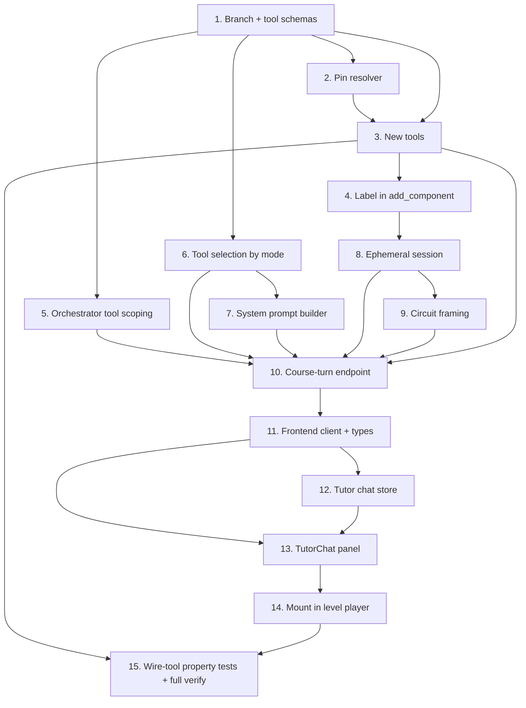

# Implementation Plan

## Overview
Source of truth: `design.md` and `requirements.md` in this folder. Work happens on a new branch `feature/in-course-ai-tutor`. Each top-level task is an atomic checkpoint per `.kiro/steering/commit-checkpoints.md` — stage only its files, verify lint/tests, then commit with the suggested conventional message. Tests are added with the feature, not after.

## Task Dependency Graph


```json
{
  "waves": [
    { "wave": 1, "tasks": ["1"], "description": "Branch + connection/movement tool schemas" },
    { "wave": 2, "tasks": ["2", "5", "6"], "description": "Pin resolver, orchestrator tool scoping, mode-based tool selection (parallel after schemas)" },
    { "wave": 3, "tasks": ["3", "7"], "description": "New tool implementations and system prompt builder" },
    { "wave": 4, "tasks": ["4"], "description": "Carry component label through add_component" },
    { "wave": 5, "tasks": ["8"], "description": "Ephemeral course session seed/collect/discard" },
    { "wave": 6, "tasks": ["9"], "description": "Circuit framing renderer" },
    { "wave": 7, "tasks": ["10"], "description": "Course-turn API endpoint" },
    { "wave": 8, "tasks": ["11"], "description": "Frontend API client + types" },
    { "wave": 9, "tasks": ["12", "13"], "description": "Tutor chat store and TutorChat panel" },
    { "wave": 10, "tasks": ["14"], "description": "Mount TutorChat in the level player" },
    { "wave": 11, "tasks": ["15"], "description": "Wire-tool property tests + full verification" }
  ]
}
```

## Tasks

- [ ] 1. Branch + tool schemas for connection/movement
  - Create branch `feature/in-course-ai-tutor` off the current branch.
  - In `backend/app/services/agent/schemas.py` add `AddWireArgs/AddWireResult`, `RemoveWireArgs/RemoveWireResult`, `MoveComponentArgs/MoveComponentResult` (strict, no `Optional`, reuse `Position`).
  - Register the three pairs in `TOOL_SCHEMAS`.
  - Commit: `feat: add wire/move agent tool schemas`
  - _Requirements: 1.6, 1.7_

- [ ] 2. Pin-resolution helper
  - In `backend/app/services/agent/tools/_helpers.py` add `_resolve_pin(registry, components, label, pin_name, expected) -> (component_id, pin_id)` reading label from `component.properties["label"]` and validating pin name + `PinType` against the registry; raise `ToolError("COMPONENT_NOT_FOUND" | "INVALID_PIN", ...)`.
  - Unit tests in `backend/tests/unit/`: resolve OK, unknown label, unknown pin, direction mismatch.
  - Commit: `feat: add registry-aware pin resolver for agent tools`
  - _Requirements: 1.3, 1.7_

- [ ] 3. Implement the three new tools
  - [ ] 3.1 `backend/app/services/agent/tools/add_wire.py` — resolve from/to pins, build `Wire(uuid4())`, route through `CircuitService.add_wire`, map `ValidationException` → `ToolError` (`INVALID_WIRE_DIRECTION`/`INPUT_ALREADY_CONNECTED`/`DUPLICATE_WIRE`), return `{wire_id, seq}`.
    - _Requirements: 1.1, 1.2, 1.3_
  - [ ] 3.2 `backend/app/services/agent/tools/remove_wire.py` — route through `CircuitService.delete_wire`, map `NotFoundException` → `ToolError("WIRE_NOT_FOUND", ...)`, return `{seq}`.
    - _Requirements: 1.4_
  - [ ] 3.3 `backend/app/services/agent/tools/move_component.py` — route through `CircuitService.move_component`, map `NotFoundException` → `ToolError("COMPONENT_NOT_FOUND", ...)`, return `{seq}`.
    - _Requirements: 1.5_
  - [ ] 3.4 Register all three in `TOOLS` and exports in `backend/app/services/agent/tools/__init__.py`.
    - _Requirements: 1.6_
  - [ ] 3.5 Per-tool unit tests in `backend/tests/unit/` mirroring existing tool tests (happy path event+seq; each failure code).
    - _Requirements: 1.1, 1.2, 1.3, 1.4, 1.5_
  - Commit: `feat: add add_wire/remove_wire/move_component agent tools`

- [ ] 4. Carry component label through `add_component`
  - In `backend/app/services/agent/tools/add_component.py` set `component.properties["label"] = args.label` before persisting (additive, one line).
  - Update/extend the `add_component` unit test to assert the label lands in `properties`.
  - Commit: `feat: persist component label in add_component tool`
  - _Requirements: 3.7_

- [ ] 5. Orchestrator tool scoping
  - In `backend/app/services/agent/orchestrator/loop.py` add required `allowed_tools: set[str]` to `run_turn` and make `_tools_for_llm(allowed_tools)` iterate only those names.
  - Update the existing `/agent/turn` caller in `backend/app/api/agent.py` to pass `set(TOOL_SCHEMAS)` (preserve behavior).
  - Update orchestrator unit tests for the new parameter; assert offered tools ⊆ `allowed_tools`.
  - Commit: `refactor: scope orchestrator tools via allowed_tools`
  - _Requirements: 4.1, 4.6, 5.3_

- [ ] 6. Tool selection by mode
  - New `backend/app/services/agent/tool_selection.py` with `select_tools(mode) -> set[str]` (theory = read-only set; practical = full set), always ⊆ `TOOL_SCHEMAS`.
  - Unit tests: exact sets per mode; theory disjoint from mutation tools; subset invariant.
  - Property test (Hypothesis) PBT-3 in `backend/tests/property/`: tool-scoping invariants.
  - Commit: `feat: add mode-based tool selection`
  - _Requirements: 4.1_

- [ ] 7. Course-aware system prompt builder
  - New `backend/app/services/agent/prompt.py` with `LevelContext` dataclass and `build_tutor_system_prompt(level, mode)` producing role+harness, level framing, mode-scoped tool list, and behavioral rules (per design ordering).
  - Unit tests: theory vs practical content; tool list matches `select_tools(mode)`; level fields appear.
  - Commit: `feat: add course-aware tutor system prompt builder`
  - _Requirements: 4.4, 4.7_

- [ ] 8. Ephemeral course session (seed / collect / discard)
  - New `backend/app/services/agent/course_session.py`: `seed_session(circuit) -> session_id` (server-generated `tutor-<uuid>`, replay components then wires via `CircuitService`, copy ids/pins verbatim, store label in `properties["label"]`); helper to collect events `> base_seq` and map to client-applicable mutations; `discard_session(session_id)` via `delete_events_by_session` + `delete_snapshots_by_session` + `cleanup_session`.
  - Unit tests: seed→read round-trip equality (up to ids); discard removes events.
  - Property test (Hypothesis) PBT-1 in `backend/tests/property/`: framing(getState(seed(c))) == framing(c).
  - Commit: `feat: add ephemeral course session seeding for tutor`
  - _Requirements: 3.1, 3.4, 3.5, 3.6_

- [ ] 9. Circuit framing renderer
  - Add `renderCircuitFraming(circuit) -> str` (compact, deterministic, labels + pin names only, never UUIDs) — backend, used by the course-turn handler to frame the board into the newest user turn.
  - Unit tests: empty board, components-only, full board; assert no UUIDs in output.
  - Property test (Hypothesis) PBT-5 in `backend/tests/property/`: context windowing keeps `messages[0]` as system prompt and respects budget (reuses `AgentContext`).
  - Commit: `feat: add label-based circuit framing for tutor context`
  - _Requirements: 4.2, 4.5_

- [ ] 10. Course-turn API endpoint
  - In `backend/app/api/agent.py` add `CourseTurnRequest`, `CircuitMutation`, `CourseTurnResponse` (camelCase aliases) and `POST /api/agent/course-turn` implementing the handler: load `LevelContent` → project `LevelContext` → build prompt → `select_tools(mode)` → `seed_session` → `run_turn(..., allowed_tools)` → collect mutations → `discard_session` (in `finally`).
  - Keep provider/apiKey/model per-request; do not log/store them.
  - Integration test against a stubbed provider emitting a scripted `add_wire`: response `mutations` contain `WIRE_ADDED`; ephemeral session gone afterward.
  - Commit: `feat: add POST /api/agent/course-turn endpoint`
  - _Requirements: 3.2, 3.5, 4.3, 5.1, 5.2, 5.3, 5.5_

- [ ] 11. Frontend API client + types
  - In `frontend/src/types/index.ts` add `CircuitMutation`, `CourseTurnResponse`, `TutorMessage` types.
  - In `frontend/src/services/api.ts` add `api.agentCourseTurn(courseId, levelNumber, mode, message, circuit, actorId, llmConfig)`.
  - Commit: `feat: add agentCourseTurn client method and types`
  - _Requirements: 5.4_

- [ ] 12. Tutor chat store
  - New `frontend/src/stores/tutorChatStore.ts`: `threads` keyed by `${courseId}:${levelNumber}:${mode}`, `pending`, `appendMessage`, `setPending`, `reset`.
  - Vitest: thread keying isolation; pending toggling.
  - Commit: `feat: add tutorChatStore for per-step chat threads`
  - _Requirements: 2.5_

- [ ] 13. TutorChat panel + mutation application
  - New `frontend/src/components/circuit/TutorChat.tsx` with props `{courseId, levelNumber, mode}`: read snapshot from `circuitStore` at send time; require `llmConfigStore` else open `APIKeyModal`; call `api.agentCourseTurn`; render `finalMessage`; disable input while pending; soft notice on `aborted`.
  - `applyMutations(mutations, store)` fixed switch mapping to existing `circuitStore` actions (no new mutators).
  - Vitest: `applyMutations` dispatch per event type; opens `APIKeyModal` when unconfigured.
  - Property test (fast-check) PBT-4: mutation mapping incl. idempotent re-apply of `WIRE_ADDED`.
  - Commit: `feat: add TutorChat panel with mutation application`
  - _Requirements: 2.1, 2.2, 2.3, 2.4, 2.6, 2.7, 3.3_

- [ ] 14. Mount TutorChat in the level player
  - In `frontend/src/app/courses/[courseId]/level/[levelNum]/page.tsx` mount `TutorChat`, passing `courseId`, `levelNum`, and the active tab as `mode`.
  - Manual smoke: send a "connect X to Y" message on the practical tab and confirm the wire appears on the board.
  - Commit: `feat: embed TutorChat in course level player`
  - _Requirements: 2.1, 3.3_

- [ ] 15. Property tests for wire-tool invariants + full verification
  - Property test (Hypothesis) PBT-2 in `backend/tests/property/`: random `add_wire` either raises a documented `ToolError` code or succeeds with source=OUTPUT, target=INPUT, no second driver.
  - Run full backend test suite (`pytest`) and frontend tests (`vitest --run`); fix failures.
  - Commit: `test: add wire-tool invariant property tests`
  - _Requirements: 1.1, 1.2_

## Notes
- Branch: all work on `feature/in-course-ai-tutor`; commits stay local (no push unless asked).
- Each task maps to an atomic conventional commit; stage only that task's files.
- The existing `/agent/turn` endpoint and the six existing tool shapes must remain unchanged (Req 5.3); the contract extension is intentional and documented in `design.md`.
- Property-based test infra already exists: Hypothesis (`backend/tests/property/`) and fast-check (frontend).
