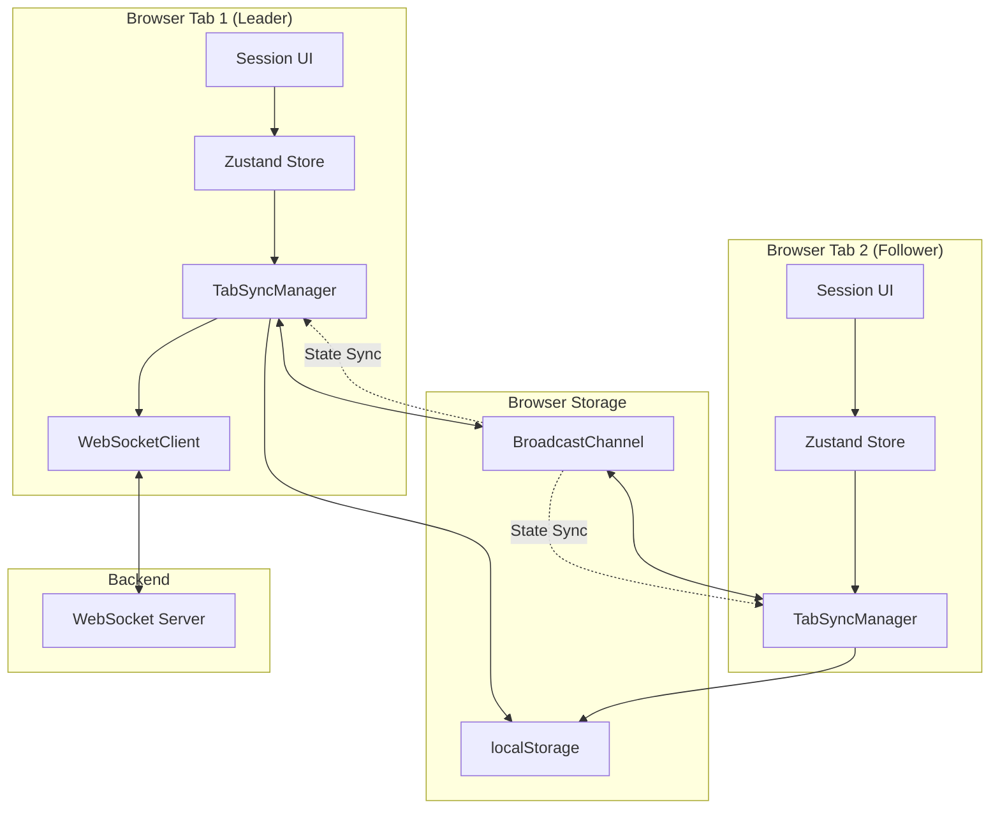

# Design Document: Session Management Improvements

## Overview

This design document outlines the architecture and implementation approach for improving session management in CircuitForge. The improvements focus on three core capabilities:

1. **Session Close Protection**: Preventing accidental session termination through browser confirmation dialogs and in-app modals
2. **Cross-Tab Synchronization**: Sharing session state across multiple browser tabs using the BroadcastChannel API with a leader/follower coordination model
3. **Session State Persistence**: Enabling users to rejoin sessions after accidental tab closure

The design leverages modern browser APIs (BroadcastChannel, localStorage, beforeunload) and follows a leader-election pattern for coordinating WebSocket connections across tabs.

## Architecture



## Components and Interfaces

### 1. TabSyncManager

The central coordinator for cross-tab communication and leader election.

```typescript
interface TabSyncManager {
  // Lifecycle
  initialize(sessionCode: string, participantId: string): void;
  destroy(): void;
  
  // Leadership
  isLeader(): boolean;
  acquireLeadership(): Promise<boolean>;
  releaseLeadership(): void;
  
  // State synchronization
  broadcastState(state: SyncState): void;
  requestStateFromLeader(): void;
  onStateReceived(callback: (state: SyncState) => void): void;
  
  // Action forwarding (follower -> leader)
  forwardAction(action: SyncAction): void;
  onActionReceived(callback: (action: SyncAction) => void): void;
}
```

### 2. SessionCloseGuard

Manages close protection and navigation guards.

```typescript
interface SessionCloseGuard {
  // Enable/disable protection
  enable(options: CloseGuardOptions): void;
  disable(): void;
  
  // Check if protection is active
  isActive(): boolean;
  
  // Get connected student count (for teacher warning)
  getStudentCount(): number;
}

interface CloseGuardOptions {
  isTeacher: boolean;
  studentCount: number;
  onLeaveConfirmed: () => void;
  onLeaveCancelled: () => void;
}
```

### 3. SessionPersistence

Handles localStorage operations for session recovery.

```typescript
interface SessionPersistence {
  // Save session for recovery
  saveSession(data: PersistedSession): void;
  
  // Load saved session
  loadSession(): PersistedSession | null;
  
  // Clear saved session
  clearSession(): void;
  
  // Check if session is still valid (within 24 hours)
  isSessionValid(data: PersistedSession): boolean;
}

interface PersistedSession {
  sessionCode: string;
  participantId: string;
  displayName: string;
  savedAt: number; // timestamp
  schemaVersion: string;
}
```

### 4. Enhanced WebSocketClient

Extended to support leader/follower mode.

```typescript
interface EnhancedWebSocketClient extends WebSocketClient {
  // Connection mode
  setMode(mode: 'leader' | 'follower'): void;
  getMode(): 'leader' | 'follower';
  
  // Follower mode: forward actions to leader
  setActionForwarder(forwarder: (action: SyncAction) => void): void;
}
```

## Data Models

### SyncState

State broadcast between tabs via BroadcastChannel.

```typescript
interface SyncState {
  type: 'state';
  sessionCode: string;
  circuit: CircuitState;
  participants: Participant[];
  currentParticipant: Participant;
  isConnected: boolean;
  isSimulationRunning: boolean;
  timestamp: number;
}
```

### SyncAction

Actions forwarded from follower tabs to leader.

```typescript
interface SyncAction {
  type: 'action';
  actionType: string; // e.g., 'circuit:component:add'
  payload: unknown;
  sourceTabId: string;
  timestamp: number;
}
```

### SessionLock

Stored in localStorage for leader election.

```typescript
interface SessionLock {
  tabId: string;
  sessionCode: string;
  acquiredAt: number;
  lastHeartbeat: number;
}
```

### BroadcastMessage

Union type for all BroadcastChannel messages.

```typescript
type BroadcastMessage =
  | { type: 'leader:announce'; tabId: string; timestamp: number }
  | { type: 'leader:heartbeat'; tabId: string; timestamp: number }
  | { type: 'state:sync'; state: SyncState }
  | { type: 'state:request'; tabId: string }
  | { type: 'action:forward'; action: SyncAction }
  | { type: 'action:result'; action: SyncAction; success: boolean };
```


## Correctness Properties

*A property is a characteristic or behavior that should hold true across all valid executions of a system-essentially, a formal statement about what the system should do. Properties serve as the bridge between human-readable specifications and machine-verifiable correctness guarantees.*

Based on the prework analysis, the following correctness properties have been identified:

### Property 1: Close Protection Registration
*For any* session state with one or more participants (teacher or students), the beforeunload event handler SHALL be registered to prevent accidental closure.
**Validates: Requirements 1.1, 1.5**

### Property 2: Single Leader Invariant
*For any* set of tabs open for the same session, exactly one tab SHALL be designated as the leader at any point in time.
**Validates: Requirements 2.2**

### Property 3: Leader Succession
*For any* session with multiple tabs where the leader tab closes, one of the remaining follower tabs SHALL become the new leader within 5 seconds.
**Validates: Requirements 2.3**

### Property 4: State Broadcast Consistency
*For any* circuit state change in the leader tab, all follower tabs SHALL receive the updated state via BroadcastChannel.
**Validates: Requirements 2.4**

### Property 5: New Tab State Synchronization
*For any* new tab joining an existing session, the tab SHALL receive the current circuit state, participant list, and connection status from the leader tab.
**Validates: Requirements 2.1, 2.5**

### Property 6: Session Persistence Round-Trip
*For any* valid PersistedSession object, serializing to JSON and then deserializing SHALL produce an equivalent PersistedSession object.
**Validates: Requirements 3.5, 3.6, 3.7**

### Property 7: Lock Acquisition Based on State
*For any* tab attempting to join a session:
- If no lock exists, the tab SHALL acquire the lock and become leader
- If a fresh lock exists (< 5 seconds old), the tab SHALL become a follower
- If a stale lock exists (>= 5 seconds old), the tab SHALL acquire the lock and become leader
**Validates: Requirements 4.1, 4.2, 4.3, 4.4**

### Property 8: Leader Heartbeat Maintenance
*For any* leader tab, the session lock timestamp SHALL be updated at least every 2 seconds while the tab remains active.
**Validates: Requirements 4.5**

### Property 9: Leader Failover on Heartbeat Timeout
*For any* follower tab that does not receive a leader heartbeat for 5 seconds, the tab SHALL attempt to acquire leadership.
**Validates: Requirements 4.6**

### Property 10: Deterministic Leadership Tie-Breaking
*For any* set of tabs attempting to acquire leadership simultaneously, the tab with the lowest tab ID SHALL win leadership.
**Validates: Requirements 4.7**

### Property 11: Action Forwarding and Broadcasting
*For any* edit action performed in a follower tab, the action SHALL be forwarded to the leader tab, and the result SHALL be broadcast back to all tabs.
**Validates: Requirements 5.4, 5.5**

## Error Handling

### Network Errors
- **WebSocket Disconnection**: Leader tab attempts reconnection with exponential backoff. Follower tabs display "Reconnecting..." status.
- **BroadcastChannel Failure**: Falls back to localStorage polling for state synchronization (every 500ms).

### Tab Coordination Errors
- **Stale Lock Detection**: If a lock's lastHeartbeat is more than 5 seconds old, it's considered stale and can be overwritten.
- **Split Brain Prevention**: Use localStorage as the source of truth for leadership. Tabs periodically verify their leadership status.
- **Race Condition Handling**: Use atomic localStorage operations with timestamp-based conflict resolution.

### User Errors
- **Accidental Navigation**: Display confirmation dialog with clear options to stay or leave.
- **Multiple Leave Attempts**: Debounce leave actions to prevent duplicate disconnections.

## Testing Strategy

### Dual Testing Approach

This feature requires both unit tests and property-based tests:

1. **Unit Tests**: Verify specific examples, edge cases, and UI interactions
2. **Property-Based Tests**: Verify universal properties that should hold across all inputs

### Property-Based Testing Framework

We will use **fast-check** for property-based testing in TypeScript/JavaScript.

```bash
npm install --save-dev fast-check
```

### Test Categories

#### 1. TabSyncManager Tests
- Property tests for leader election invariants
- Property tests for state synchronization
- Unit tests for BroadcastChannel message handling

#### 2. SessionCloseGuard Tests
- Unit tests for beforeunload registration/unregistration
- Unit tests for modal display logic
- Integration tests for navigation guards

#### 3. SessionPersistence Tests
- Property tests for round-trip serialization
- Unit tests for localStorage operations
- Unit tests for session validity checking (24-hour expiry)

#### 4. Integration Tests
- Multi-tab coordination scenarios
- Leader failover scenarios
- State synchronization under concurrent edits

### Property Test Configuration

Each property-based test should run a minimum of 100 iterations:

```typescript
import fc from 'fast-check';

fc.assert(
  fc.property(/* generators */, /* property */),
  { numRuns: 100 }
);
```

### Test Annotation Format

Each property-based test must be annotated with:
```typescript
/**
 * **Feature: session-management, Property 6: Session Persistence Round-Trip**
 * **Validates: Requirements 3.5, 3.6, 3.7**
 */
```

## Implementation Notes

### BroadcastChannel Usage

```typescript
// Create channel for session
const channel = new BroadcastChannel(`circuitforge-session-${sessionCode}`);

// Send message
channel.postMessage({ type: 'state:sync', state: currentState });

// Receive messages
channel.onmessage = (event) => {
  const message = event.data as BroadcastMessage;
  handleMessage(message);
};

// Cleanup
channel.close();
```

### localStorage Lock Pattern

```typescript
const LOCK_KEY = `circuitforge-lock-${sessionCode}`;
const LOCK_TIMEOUT = 5000; // 5 seconds
const HEARTBEAT_INTERVAL = 2000; // 2 seconds

function acquireLock(tabId: string): boolean {
  const existing = localStorage.getItem(LOCK_KEY);
  if (existing) {
    const lock: SessionLock = JSON.parse(existing);
    const age = Date.now() - lock.lastHeartbeat;
    if (age < LOCK_TIMEOUT) {
      return false; // Lock is fresh, become follower
    }
  }
  
  // Acquire lock
  const newLock: SessionLock = {
    tabId,
    sessionCode,
    acquiredAt: Date.now(),
    lastHeartbeat: Date.now(),
  };
  localStorage.setItem(LOCK_KEY, JSON.stringify(newLock));
  return true;
}
```

### beforeunload Handler

```typescript
function setupCloseProtection(studentCount: number) {
  const handler = (e: BeforeUnloadEvent) => {
    if (studentCount > 0) {
      e.preventDefault();
      e.returnValue = ''; // Required for Chrome
      return ''; // Required for some browsers
    }
  };
  
  window.addEventListener('beforeunload', handler);
  return () => window.removeEventListener('beforeunload', handler);
}
```

## File Structure

```
frontend/src/
├── services/
│   ├── tabSync.ts          # TabSyncManager implementation
│   ├── sessionPersistence.ts # SessionPersistence implementation
│   └── websocket.ts        # Enhanced WebSocketClient
├── hooks/
│   ├── useTabSync.ts       # React hook for tab synchronization
│   ├── useCloseGuard.ts    # React hook for close protection
│   └── useSessionRecovery.ts # React hook for session recovery
├── components/
│   └── ui/
│       └── LeaveConfirmModal.tsx # Confirmation modal for leaving
└── stores/
    └── sessionStore.ts     # Enhanced with tab sync state
```
