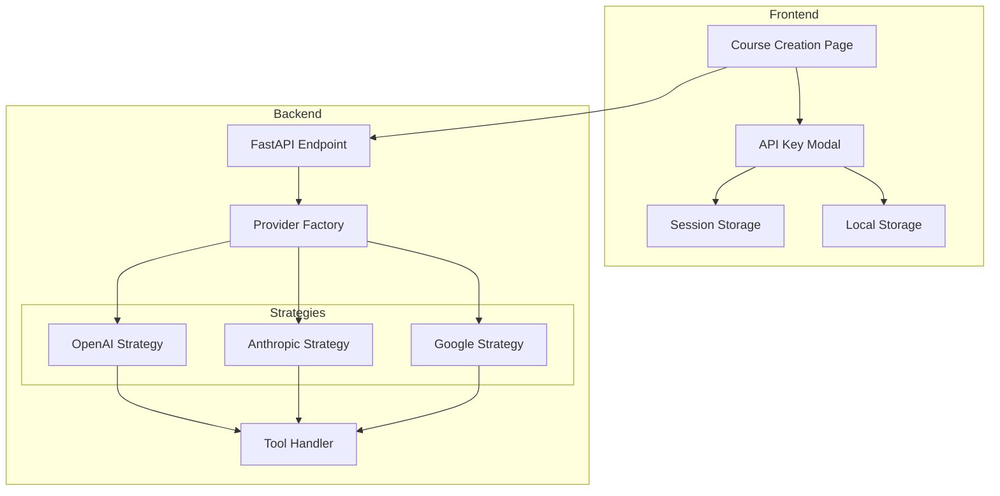

# Design Document: User LLM API Keys

## Overview

This design enables users to provide their own LLM API keys from various providers to generate circuit courses. The system uses the Strategy pattern for provider abstraction and dependency injection for runtime provider selection. API keys are never stored on the server—they're passed per-request and discarded immediately after use.

## Architecture



## Components and Interfaces

### Frontend Components

#### 1. APIKeyModal Component
Location: `frontend/src/components/ui/APIKeyModal.tsx`

```typescript
interface LLMProvider {
  id: string;
  name: string;
  icon: string;
  baseUrl: string;
  models: ModelOption[];
  keyPrefix?: string; // For format validation (e.g., "sk-" for OpenAI)
  docsUrl: string;
}

interface ModelOption {
  id: string;
  name: string;
  description: string;
  isDefault?: boolean;
}

interface APIKeyConfig {
  provider: string;
  apiKey: string;
  model: string;
  temperature?: number;
  maxTokens?: number;
}

interface APIKeyModalProps {
  isOpen: boolean;
  onClose: () => void;
  onSave: (config: APIKeyConfig) => void;
  initialConfig?: Partial<APIKeyConfig>;
}
```

#### 2. LLM Config Store
Location: `frontend/src/stores/llmConfigStore.ts`

```typescript
interface LLMConfigState {
  // Session storage (cleared on tab close)
  apiKey: string | null;
  
  // Local storage (persisted)
  provider: string;
  model: string;
  temperature: number;
  maxTokens: number;
  
  // Actions
  setApiKey: (key: string) => void;
  clearApiKey: () => void;
  setProvider: (provider: string) => void;
  setModel: (model: string) => void;
  setAdvancedSettings: (temp: number, tokens: number) => void;
  isConfigured: () => boolean;
}
```

### Backend Components

#### 1. Provider Strategy Interface
Location: `backend/app/services/llm_providers.py`

```python
from abc import ABC, abstractmethod
from typing import Any, Dict, List
from pydantic import BaseModel

class LLMRequest(BaseModel):
    """Common request format for all providers."""
    messages: List[Dict[str, Any]]
    tools: List[Dict[str, Any]]
    model: str
    temperature: float = 0.7
    max_tokens: int = 4000

class LLMResponse(BaseModel):
    """Normalized response from any provider."""
    content: Dict[str, Any]
    tool_calls: List[Dict[str, Any]]
    token_usage: int
    finish_reason: str

class LLMProviderStrategy(ABC):
    """Abstract base for LLM provider implementations."""
    
    @abstractmethod
    async def call(
        self,
        api_key: str,
        request: LLMRequest,
    ) -> LLMResponse:
        """Make API call to the provider."""
        pass
    
    @abstractmethod
    def validate_key_format(self, api_key: str) -> bool:
        """Validate API key format (not validity)."""
        pass
```

#### 2. Provider Implementations

```python
class OpenAICompatibleStrategy(LLMProviderStrategy):
    """Strategy for OpenAI and OpenAI-compatible APIs."""
    
    def __init__(self, base_url: str, key_prefix: str = "sk-"):
        self.base_url = base_url
        self.key_prefix = key_prefix
    
    async def call(self, api_key: str, request: LLMRequest) -> LLMResponse:
        # Uses chat/completions endpoint with tools
        pass
    
    def validate_key_format(self, api_key: str) -> bool:
        return api_key.startswith(self.key_prefix) if self.key_prefix else True

class AnthropicStrategy(LLMProviderStrategy):
    """Strategy for Anthropic Claude API."""
    
    async def call(self, api_key: str, request: LLMRequest) -> LLMResponse:
        # Uses messages endpoint with tool_use
        pass
    
    def validate_key_format(self, api_key: str) -> bool:
        return api_key.startswith("sk-ant-")

class GoogleStrategy(LLMProviderStrategy):
    """Strategy for Google Gemini API."""
    
    async def call(self, api_key: str, request: LLMRequest) -> LLMResponse:
        # Uses generateContent endpoint with functionDeclarations
        pass
    
    def validate_key_format(self, api_key: str) -> bool:
        return len(api_key) == 39  # Google API keys are 39 chars
```

#### 3. Provider Factory
Location: `backend/app/services/llm_provider_factory.py`

```python
class LLMProviderFactory:
    """Factory for creating provider strategy instances."""
    
    PROVIDERS = {
        "openai": lambda: OpenAICompatibleStrategy(
            base_url="https://api.openai.com/v1/chat/completions",
            key_prefix="sk-"
        ),
        "anthropic": lambda: AnthropicStrategy(),
        "google": lambda: GoogleStrategy(),
        "ohmygpt": lambda: OpenAICompatibleStrategy(
            base_url="https://api.ohmygpt.com/v1/chat/completions",
            key_prefix=""
        ),
        "megallm": lambda: OpenAICompatibleStrategy(
            base_url="https://api.megallm.com/v1/chat/completions",
            key_prefix=""
        ),
        "agentrouter": lambda: OpenAICompatibleStrategy(
            base_url="https://api.agentrouter.ai/v1/chat/completions",
            key_prefix=""
        ),
        "openrouter": lambda: OpenAICompatibleStrategy(
            base_url="https://openrouter.ai/api/v1/chat/completions",
            key_prefix="sk-or-"
        ),
    }
    
    @classmethod
    def get_provider(cls, provider_id: str) -> LLMProviderStrategy:
        """Get provider strategy by ID."""
        if provider_id not in cls.PROVIDERS:
            raise ValueError(f"Unknown provider: {provider_id}")
        return cls.PROVIDERS[provider_id]()
```

#### 4. Updated LLM Service
Location: `backend/app/services/llm_service.py`

```python
class LLMService:
    """Service for LLM operations using user-provided API keys."""
    
    def __init__(self):
        self.tool_handler = get_tool_handler()
    
    async def generate_course_plan(
        self,
        topic: str,
        provider_id: str,
        api_key: str,
        model: str,
        temperature: float = 0.7,
        max_tokens: int = 4000,
    ) -> tuple[CoursePlan, int]:
        """Generate course plan using user's API key."""
        provider = LLMProviderFactory.get_provider(provider_id)
        
        if not provider.validate_key_format(api_key):
            raise ValueError(f"Invalid API key format for {provider_id}")
        
        # Build request and call provider
        # API key is used only here and not stored
        pass
```

## Data Models

### API Request Models

```python
class GeneratePlanRequest(BaseModel):
    """Request to generate a course plan with user API key."""
    topic: str = Field(min_length=3, max_length=200)
    participant_id: str | None = Field(default=None, alias="participantId")
    
    # LLM Configuration (passed per-request)
    provider: str = Field(description="LLM provider ID")
    api_key: str = Field(description="User's API key", min_length=10)
    model: str = Field(description="Model to use")
    temperature: float = Field(default=0.7, ge=0, le=2)
    max_tokens: int = Field(default=4000, ge=100, le=32000)

class TestConnectionRequest(BaseModel):
    """Request to test API key validity."""
    provider: str
    api_key: str
    model: str
```

### Provider Configuration (Frontend)

```typescript
const PROVIDERS: LLMProvider[] = [
  {
    id: 'openai',
    name: 'OpenAI',
    icon: 'openai',
    baseUrl: 'https://api.openai.com',
    keyPrefix: 'sk-',
    docsUrl: 'https://platform.openai.com/api-keys',
    models: [
      { id: 'gpt-4o', name: 'GPT-4o', description: 'Most capable model', isDefault: true },
      { id: 'gpt-4-turbo', name: 'GPT-4 Turbo', description: 'Fast and capable' },
      { id: 'gpt-3.5-turbo', name: 'GPT-3.5 Turbo', description: 'Fast and economical' },
    ],
  },
  {
    id: 'anthropic',
    name: 'Anthropic',
    icon: 'anthropic',
    baseUrl: 'https://api.anthropic.com',
    keyPrefix: 'sk-ant-',
    docsUrl: 'https://console.anthropic.com/settings/keys',
    models: [
      { id: 'claude-3-5-sonnet-20241022', name: 'Claude 3.5 Sonnet', description: 'Best balance', isDefault: true },
      { id: 'claude-3-opus-20240229', name: 'Claude 3 Opus', description: 'Most capable' },
      { id: 'claude-3-haiku-20240307', name: 'Claude 3 Haiku', description: 'Fastest' },
    ],
  },
  // ... other providers
];
```


## Error Handling

### Error Categories and Responses

| Error Type | HTTP Status | User Message |
|------------|-------------|--------------|
| Invalid key format | 400 | "API key format is invalid for {provider}" |
| Authentication failed | 401 | "API key is invalid or expired" |
| Rate limited | 429 | "Rate limit exceeded. Please wait and try again" |
| Quota exceeded | 402 | "API quota exceeded. Check your billing" |
| Model unavailable | 400 | "Model {model} is not available. Try {alternatives}" |
| Provider unavailable | 503 | "{provider} API is currently unavailable" |

### Error Response Format

```python
class LLMError(Exception):
    """Base exception for LLM-related errors."""
    def __init__(self, code: str, message: str, provider: str):
        self.code = code
        self.message = message
        self.provider = provider

class AuthenticationError(LLMError):
    """Invalid or expired API key."""
    pass

class RateLimitError(LLMError):
    """Rate limit exceeded."""
    def __init__(self, provider: str, retry_after: int | None = None):
        super().__init__("RATE_LIMITED", "Rate limit exceeded", provider)
        self.retry_after = retry_after

class QuotaExceededError(LLMError):
    """API quota/billing issue."""
    pass
```

## Testing Strategy

### Unit Tests
- Provider strategy implementations (mock HTTP calls)
- Key format validation for each provider
- Error handling and response normalization
- Frontend store state management

### Property-Based Tests
- API key format validation across random inputs
- Request/response serialization round-trips

### Integration Tests
- End-to-end course generation with test API keys
- Modal flow and session storage behavior


## Correctness Properties

*A property is a characteristic or behavior that should hold true across all valid executions of a system—essentially, a formal statement about what the system should do. Properties serve as the bridge between human-readable specifications and machine-verifiable correctness guarantees.*

### Property 1: Provider Selection Displays Correct Models with Default

*For any* provider ID in the supported providers list, selecting that provider SHALL display a non-empty list of models where exactly one model is marked as default.

**Validates: Requirements 1.2, 3.5**

### Property 2: API Key Format Validation with Provider-Specific Errors

*For any* API key string and provider ID, the format validation function SHALL return either success (if format matches provider's key pattern) or a provider-specific error message (if format is invalid).

**Validates: Requirements 2.2, 8.2**

### Property 3: OpenAI-Compatible Providers Use Chat Completions Format

*For any* OpenAI-compatible provider (openai, ohmygpt, megallm, agentrouter, openrouter), the generated API request SHALL use the chat/completions endpoint format with a tools array containing tool definitions.

**Validates: Requirements 1.5, 6.2**

### Property 4: Response Normalization Without API Key Exposure

*For any* successful LLM API response from any provider, the normalized response SHALL contain content, token_usage, and tool_calls fields, and SHALL NOT contain any API key information in any field.

**Validates: Requirements 5.6, 6.5**

### Property 5: All Providers Have Documentation URLs

*For any* provider in the supported providers configuration, the provider SHALL have a non-empty docsUrl field pointing to the API key creation page.

**Validates: Requirements 7.3**
